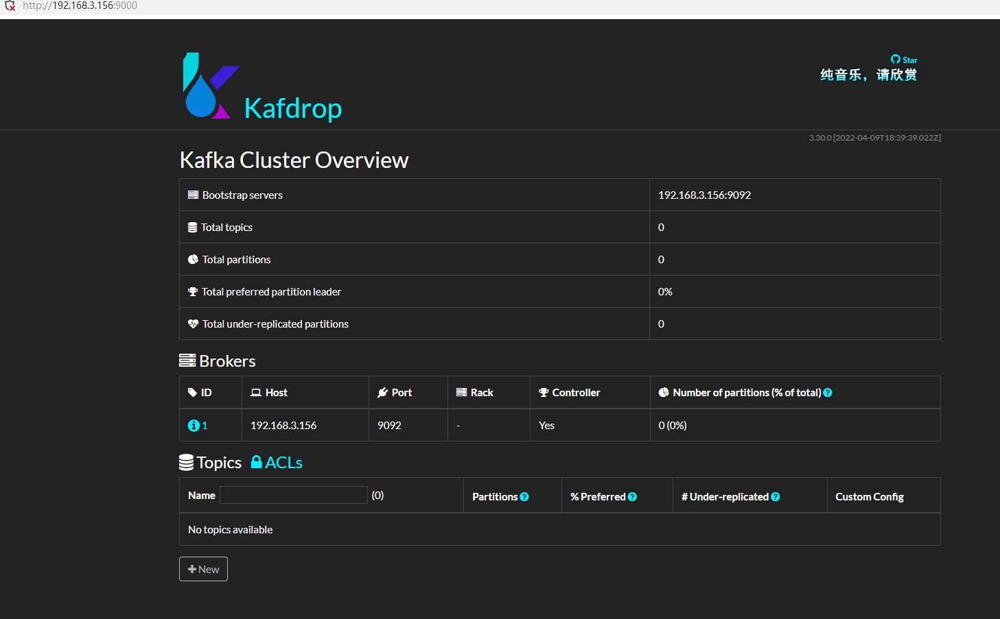
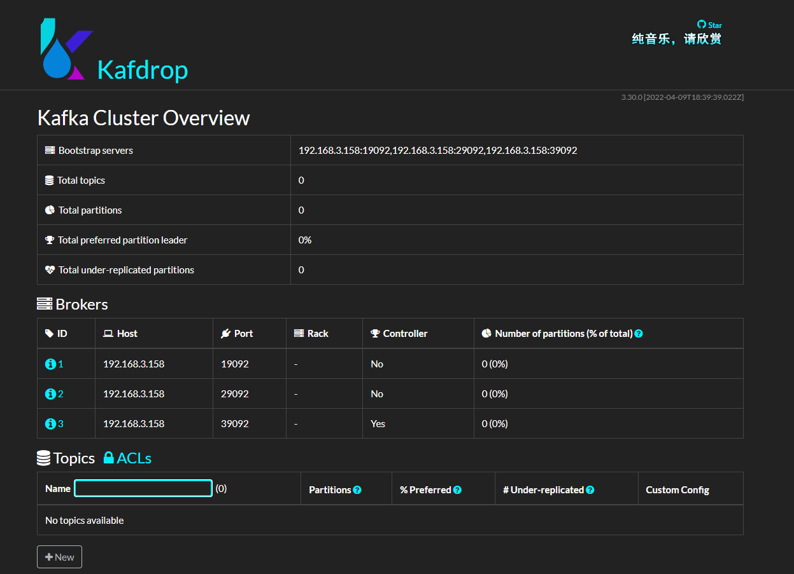

# 1,搭建 Kafka 环境

在本章中，我们将使用 Docker 快速部署一个单节点 Kafka 或 Kafka 集群。 


### 单节点 Kafka 的部署


首先是安装 docker-compose，通过 docker-compose 搭建 Kafka 比较方便，省下很多折腾时间。

快速安装 docker-compose ：

```bash
sudo curl -L "https://github.com/docker/compose/releases/download/1.29.2/docker-compose-$(uname -s)-$(uname -m)" -o /usr/local/bin/docker-compose

sudo chmod +x /usr/local/bin/docker-compose

docker-compose --version
```

> 如果系统没有映射 `/usr/local/bin/` 路径，请将文件下载到 `/usr/bin`。


接着使用 docker-compose 安装 Zookeeper 和 Kafka。


创建一个 docker-compose.yml 文件，文件内容如下：

```yml
---
version: '3'
services:
  zookeeper:
    image: confluentinc/cp-zookeeper:7.3.0
    container_name: zookeeper
    environment:
      ZOOKEEPER_CLIENT_PORT: 2181
      ZOOKEEPER_TICK_TIME: 2000

  broker:
    image: confluentinc/cp-kafka:7.3.0
    container_name: broker
    ports:
    # To learn about configuring Kafka for access across networks see
    # https://www.confluent.io/blog/kafka-client-cannot-connect-to-broker-on-aws-on-docker-etc/
      - "9092:9092"
    depends_on:
      - zookeeper
    environment:
      KAFKA_BROKER_ID: 1
      KAFKA_ZOOKEEPER_CONNECT: 'zookeeper:2181'
      KAFKA_LISTENER_SECURITY_PROTOCOL_MAP: PLAINTEXT:PLAINTEXT,PLAINTEXT_INTERNAL:PLAINTEXT
      KAFKA_ADVERTISED_LISTENERS: PLAINTEXT://192.168.3.156:9092,PLAINTEXT_INTERNAL://broker:29092
      KAFKA_OFFSETS_TOPIC_REPLICATION_FACTOR: 1
      KAFKA_TRANSACTION_STATE_LOG_MIN_ISR: 1
      KAFKA_TRANSACTION_STATE_LOG_REPLICATION_FACTOR: 1
```

> 请替换 `PLAINTEXT://192.168.3.156` 中的 IP。


然后执行命令开始部署应用：

```bash
docker-compose up -d
```


接着，安装 kafdrop，这是一个 Kafka 管理界面。

```bash
docker run -d --rm  -p 9000:9000 \
-e JVM_OPTS="-Xms32M -Xmx64M" \
-e KAFKA_BROKERCONNECT=192.168.3.156:9092 \
-e SERVER_SERVLET_CONTEXTPATH="/" \
obsidiandynamics/kafdrop
```




### 部署 Kafka 集群


其中一些重要的环境变量说明如下：

* `KAFKA_BROKER_ID`: 当前实例的 id；
* `KAFKA_NUM_PARTITIONS`：Topic 的分区数量；
* `KAFKA_DEFAULT_REPLICATION_FACTOR`：分区的副本数；
* `KAFKA_ZOOKEEPER_CONNECT`：Zookeeper 地址；
* `KAFKA_LISTENERS`：监听的 ip；
* `KAFKA_ADVERTISED_LISTENERS`：如何访问当前实例；


创建一个 docker-compose.yml 文件，文件内容如下：

 ```yml
 ---
 version: '3'
 services:
   zookeeper:
     image: confluentinc/cp-zookeeper:7.3.0
     container_name: zookeeper
     environment:
       ZOOKEEPER_CLIENT_PORT: 2181
       ZOOKEEPER_TICK_TIME: 2000
 
   kafka1:
     image: confluentinc/cp-kafka:7.3.0
     container_name: broker1
     ports:
       - 19092:9092
     depends_on:
       - zookeeper
     environment:
       KAFKA_BROKER_ID: 1
       KAFKA_NUM_PARTITIONS: 3
       KAFKA_DEFAULT_REPLICATION_FACTOR: 2
       KAFKA_ZOOKEEPER_CONNECT: 'zookeeper:2181'
       KAFKA_LISTENERS: PLAINTEXT://0.0.0.0:9092
       KAFKA_ADVERTISED_LISTENERS: PLAINTEXT://192.168.3.158:19092
     volumes:
       - /data/kafka/broker1/logs:/opt/kafka/logs
       - /var/run/docker.sock:/var/run/docker.sock
       
   kafka2:
     image: confluentinc/cp-kafka:7.3.0
     container_name: broker2
     ports:
       - 29092:9092
     depends_on:
       - zookeeper
     environment:
       KAFKA_BROKER_ID: 2
       KAFKA_NUM_PARTITIONS: 3
       KAFKA_DEFAULT_REPLICATION_FACTOR: 2
       KAFKA_ZOOKEEPER_CONNECT: 'zookeeper:2181'
       KAFKA_LISTENERS: PLAINTEXT://0.0.0.0:9092
       KAFKA_ADVERTISED_LISTENERS: PLAINTEXT://192.168.3.158:29092
     volumes:
       - /data/kafka/broker2/logs:/opt/kafka/logs
       - /var/run/docker.sock:/var/run/docker.sock
       
   kafka3:
     image: confluentinc/cp-kafka:7.3.0
     container_name: broker3
     ports:
       - 39092:9092
     depends_on:
       - zookeeper
     environment:
       KAFKA_BROKER_ID: 3
       KAFKA_NUM_PARTITIONS: 3
       KAFKA_DEFAULT_REPLICATION_FACTOR: 2
       KAFKA_ZOOKEEPER_CONNECT: 'zookeeper:2181'
       KAFKA_LISTENERS: PLAINTEXT://0.0.0.0:9092
       KAFKA_ADVERTISED_LISTENERS: PLAINTEXT://192.168.3.158:39092
     volumes:
       - /data/kafka/broker3/logs:/opt/kafka/logs
       - /var/run/docker.sock:/var/run/docker.sock
 ```


然后执行命令开始部署应用：

```bash
docker-compose up -d
```


接着部署 kafdrop：

```bash
docker run -d --rm  -p 9000:9000 \
-e JVM_OPTS="-Xms32M -Xmx64M" \
-e KAFKA_BROKERCONNECT=192.168.3.158:19092,192.168.3.158:29092,192.168.3.158:39092 \
-e SERVER_SERVLET_CONTEXTPATH="/" \
obsidiandynamics/kafdrop
```

