# 2, Kafka 概念

在本章中，我们将会学习到 Kafka 的一些基本概念。

分区、副本机制等

### 基本概念

一个简单的 `生产` -> `保存` -> `消费` 的过程示例如下：

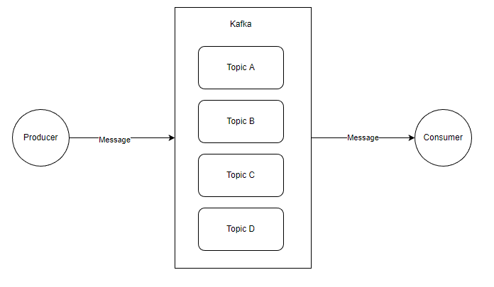

在这里，出现了四个名称：

生产者 Producer：产生 Message 的客户端；

消费者 Consumer ：消费 Message 的客户端；

主题 Topic：同一类 Message 的归类；

消息 Message： 数据实体；


当然图中每一个对象本身都是很复杂的，这里为了便于学习，我们先从最简单的结构图开始了解这些东西。


这里的图比较简单，大概是这样的， Kafka 中有多个 Topic，Producer 可以向指定的 Topic 生产一条消息，而 Consumer 可以消费指定 Topic 的消息。

Producer 和 Consumer 都是客户端应用，只是在执行的功能上有所区分，理论上 Kafka 的客户端库都是将两者的代码写在同一个模块，例如 C# 的  confluent-kafka-dotnet。


然后就是这个 Message 了，Message 主要结构是：

```
Key
Value 
其它元数据
```

其中 Value 是我们自定义消息内容的地方。

关于 Message，我们这里简单了解即可，在后面的章节中会继续深入介绍。


在 Kafka 中，每个 Kafka 实例称为 Broker，每个 Broker 中可以保存多个 Topic。每个 Topic 可以划分为多个分区，**每个分区保存的数据是不一样的，类似与数据库分库分表**。这些分区可以在同一个 Broker 中，也可以在散布在不同的 Broker 中。

一个 Broker 可以存储不同 Topic 的不同分区，也可以存储一个 Topic 的同一个分区。

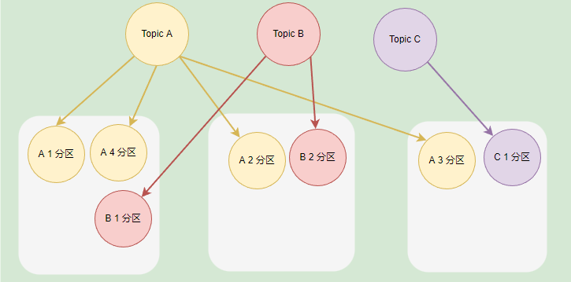


如果一个 Topic 有多个分区，一般来说其并发量会有所提高，通过增加分区数实现集群的负载均衡，一般情况下，分区均衡需要散布在不同的 Broker 才能合理地负载均衡，不然分区都在同一个 Broker 时，瓶颈也会比较小。

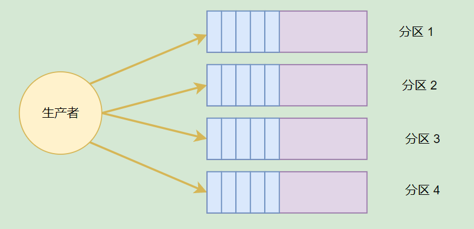


如果 Broker 的实例比较少，但是 Topic 划分了多个分区，那么这些分区会被部署到同一个 Broker 上。

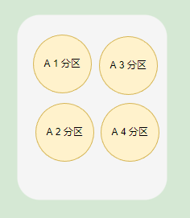


主题分区可以有效提高生产者或消费者的并发量，因为将消息分别存储到不同的分区中，可以同时往多个分区推送消息，会比只向一个分区推送消息的速度快。


前面提到，每个 Message 都有 Key 和 Value，Topic 可以根据 Message 的 Key 将一个 Message 存储到不同的分区。当然，我们也可以在生产消息的时候，指定向一个分区推送消息。

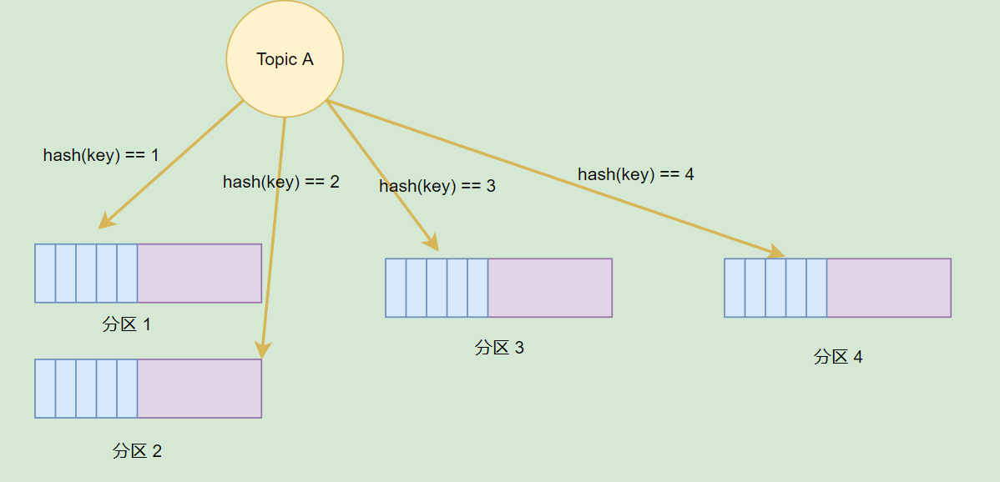


分区可以提高并发，但是如果一个 Broker 挂了，数据便会丢失，怎么办？

在 Kafka 中，分区可以设置多个分区副本，这些副本跟分区并不在同一个 Broker 上，这个当 Broker 挂了后，这些分区可以利用副本在其它 Broker 上复活。

> **[info] 提示** 
>
> 在 《Kafka权威指南（第2版）》 的 21 页中，指导了如何合理设置分区数量，以及分区的优势和缺点。


### 关于 Kafka 脚本工具

前面介绍了 Kafka 的一些简单概念，为了更加好地了解 Kafka，我们可以利用 Kafka 的脚本做一些实验。


打开其中一个 Kafka 容器(`docker exec` 命令进入容器)，然后执行命令查看自带的二进制脚本：

```bash
 ls -lah /usr/bin/ | grep kafka
```

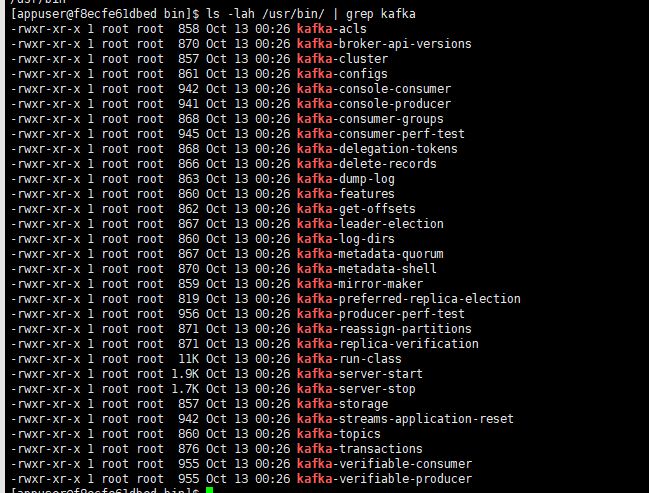


可以看到，里面有很多 CLI 工具，每种 CLI 工具说明文档可以到这里查看：

https://docs.cloudera.com/runtime/7.2.10/kafka-managing/topics/kafka-manage-basics.html


下面笔者介绍部分 CLI 工具的使用方法。


### 主题管理

kafka-topics 是用于主题管理的 CLI 工具，kafka-topics 提供基本操作如下所示：

* 操作：
  * `--create`：创建主题；
  * `--alter`：变更这个主题，修改分区数等；
  * `--config`：修改主题相关的配置；
  * `--delete`：删除该主题；


在管理主题时，我们可以设置主题配置，主题配置存储时，其格式示例为 `default.replication.factor` ，如果用 CLI 工具操作，那么传递的参数示例为 `--replication-factor`，因此我们通过不同工具操作主题时，参数名称可能不同一样。

> 主题的所有配置参数可以查看官方文档：
>
> https://kafka.apache.org/090/documentation.html


kafka-topics 一些常用参数：

* `--partitions` ：分区数量，该主题划分成多少个分区；
* `--replication-factor`：副本数量，表示每个分区一共有多少个副本；副本数量需要小于或等于 Broker 的数量；
* `--replica-assignment`：指定副本分配方案，不能与 `--partitions` 或 `--replication-factor` 同时使用；

* `--list`： 列出有效的主题；
* `--describe`：查询该主题的信息信息。


下面是使用 CLI 手工创建主题的命令，创建主题时设置分区、分区副本。

```bash
kafka-topics --create --bootstrap-server 192.168.3.158:19092 \
--replication-factor 2 \
--partitions 3 \
--topic hello-topic
```

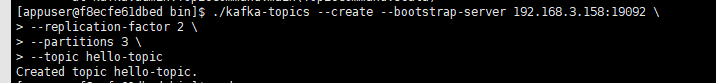

> 使用 CLI 时，可以通过 `--bootstrap-server` 配置连接到一个 Kafka 实例，或者通过 ` --zookeeper` 连接到 Zookeeper，然后 CLI 自动找到 Kafka 实例执行命令。


查看主题的详细信息：

```bash
kafka-topics --describe --bootstrap-server 192.168.3.158:19092 --topic hello-topic
```

```bash
Topic: hello-topic	TopicId: AcKRZ3ffTRKkTOTHRyHR0g	PartitionCount: 3	ReplicationFactor: 2	Configs: 
	Topic: hello-topic	Partition: 0	Leader: 3	Replicas: 3,1	Isr: 3,1
	Topic: hello-topic	Partition: 1	Leader: 1	Replicas: 1,2	Isr: 1,2
	Topic: hello-topic	Partition: 2	Leader: 2	Replicas: 2,3	Isr: 2,3
```

> 可以看到，创建的分区会被均衡分布到不同的 Broker 实例中；对于 Replicas 这些东西，我们后面的章节再讨论。


也可以打开 kafdrop 查看主题的信息。

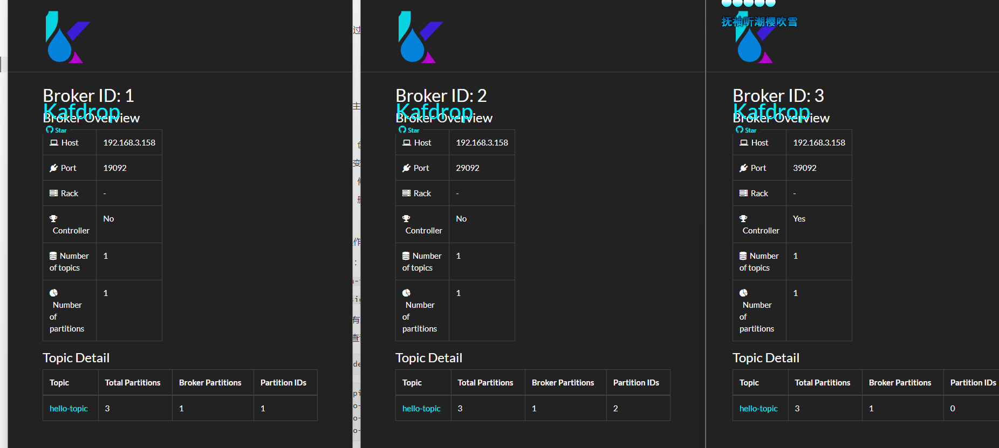


如果一个 Topic 的分区数量大于 Broker 数量呢？前面笔者已经提到，如果分区数量比较大时，部分 Broker 中会存在同一个主题的多个分区。

下面我们来实验验证一下：

```bash
kafka-topics --create --bootstrap-server 192.168.3.158:19092 \
--replication-factor 2 \
--partitions 4 \
--topic hello-topic1
```

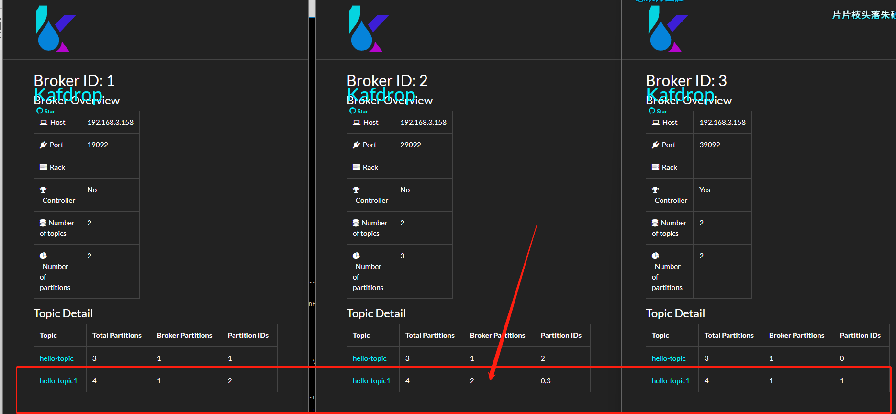


可以看到，Broker 2，分到了 `hello-topic1` 的两个分区。


### 使用 C# 创建分区

客户端库中可以利用接口管理主题，如 C# 的 confluent-kafka-dotnet，使用 C# 代码创建 Topic 的示例如下：

```csharp
    static async Task Main()
    {
        var config = new AdminClientConfig
        {
            BootstrapServers = "192.168.3.158:19092"
        };

        using (var adminClient = new AdminClientBuilder(config).Build())
        {
            try
            {
                await adminClient.CreateTopicsAsync(new TopicSpecification[] {
                    new TopicSpecification { Name = "hello-topic2", ReplicationFactor = 3, NumPartitions = 2 } });
            }
            catch (CreateTopicsException e)
            {
                Console.WriteLine($"An error occured creating topic {e.Results[0].Topic}: {e.Results[0].Error.Reason}");
            }
        }
    }
```

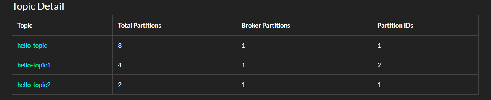


在 AdminClient 中还有很多方法可以探索。


### 生产者消费者

kafka-console-producer 可以给指定的主题发送消息：

```
kafka-console-producer --bootstrap-server 192.168.3.158:19092 --topic hello-topic
```

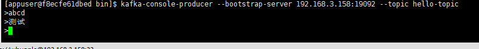


kafka-console-consumer 则可以从指定主题接收消息：

```
kafka-console-consumer --bootstrap-server 192.168.3.158:19092 --topic hello-topic \
--group hello-group \
--from-beginning
```

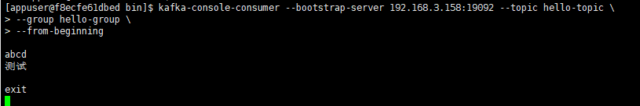


订阅主题时，消费者需要指定消费者组。可以通过 `--group ` 指定；如果不指定，脚本会自动为我们创建一个消费者组。

kafka-consumer-groups 则可以为我们管理消费者组，例如查看所有的消费者组：

```
kafka-consumer-groups --bootstrap-server 192.168.3.158:19092 --list
```

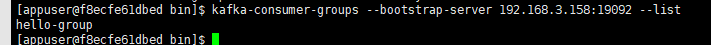


查看消费者组详细信息：

```
kafka-consumer-groups --bootstrap-server 192.168.3.158:19092 --describe --group hello-group
```

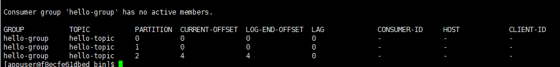


当然，也可以从 Kafdrop 界面中查看消费者组的信息。

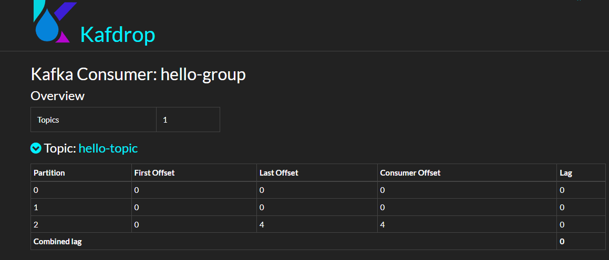

这些参数我们现在可以先跳过。


C# 部分并没有重要的内容要说，代码可以参考：

```csharp
    static async Task Main()
    {
        var config = new AdminClientConfig
        {
            BootstrapServers = "192.168.3.158:19092"
        };

        using (var adminClient = new AdminClientBuilder(config).Build())
        {
            var groups = adminClient.ListGroups(TimeSpan.FromSeconds(10));
            foreach (var item in groups)
            {
                Console.WriteLine(item.Group);
            }
        }
    }
```


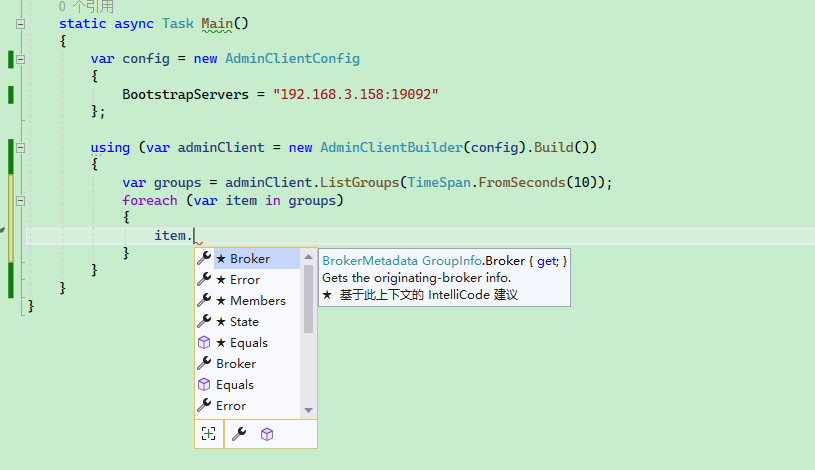


对于消费者组来说，我们需要关注以下参数：

* `state`：消费者组的状态；

* `members`：消费者组成员；

* `offsets`： ACK 偏移量；

  


### 修改配置

可以使用 kafka-configs 工具设置、描述或删除主题属性。

查看主题属性描述：

```
kafka-configs --bootstrap-server [HOST:PORT] --entity-type topics --entity-name [TOPIC] --describe
```

```
kafka-configs --bootstrap-server 192.168.3.158:19092 --entity-type topics --entity-name hello-topic --describe
```

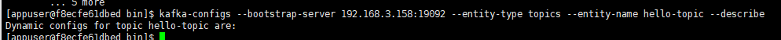


使用 `--alter` 参数后，可以添加、修改或删除主题属性，命令格式：

```
kafka-configs --bootstrap-server [HOST:PORT] --entity-type topics --entity-name [TOPIC] --alter --add-config [PROPERTY NAME]=[VALUE]
```

```
kafka-configs --bootstrap-server [HOST:PORT] --entity-type topics --entity-name [TOPIC] --alter --delete-config [PROPERTY_NAME]
```


例如 Kafka 默认限制发送的消息最大为 1MB，为了修改这个限制，可以使用以下命令：

```
kafka-configs --bootstrap-server  192.168.3.158:19092 --entity-type topics --entity-name hello-topic --alter --add-config 'max.message.bytes=1048576'
```

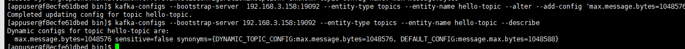


其中还有很多参数，请参考：

https://kafka.apache.org/10/documentation.html#topicconfigs


此外，我们还可以通过 kafka-configs 查看 Broker 的配置：

```
kafka-configs --bootstrap-server 192.168.3.158:19092 --describe --broker 1
```

