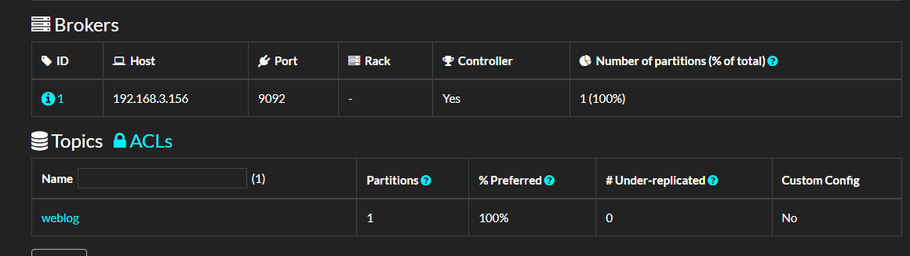
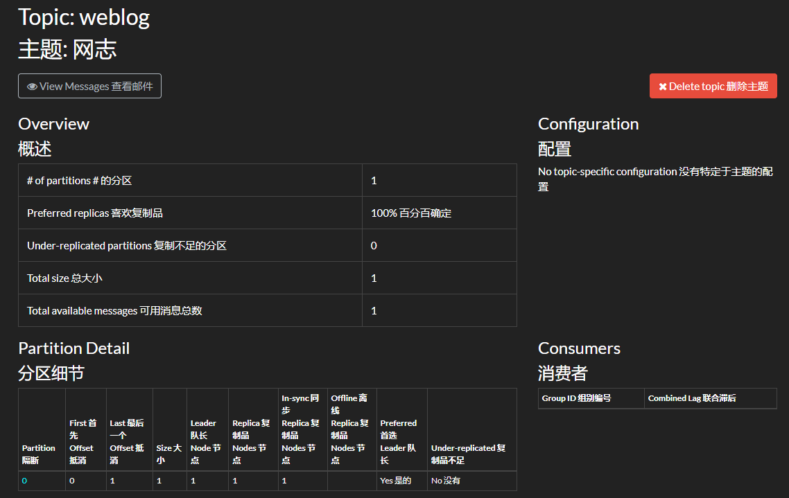
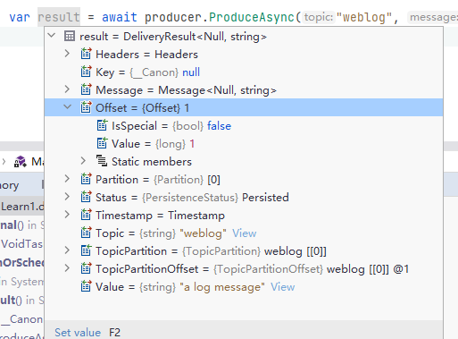
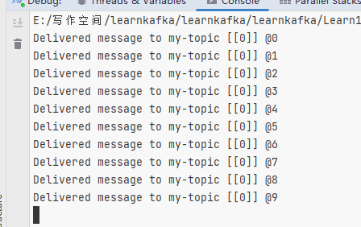
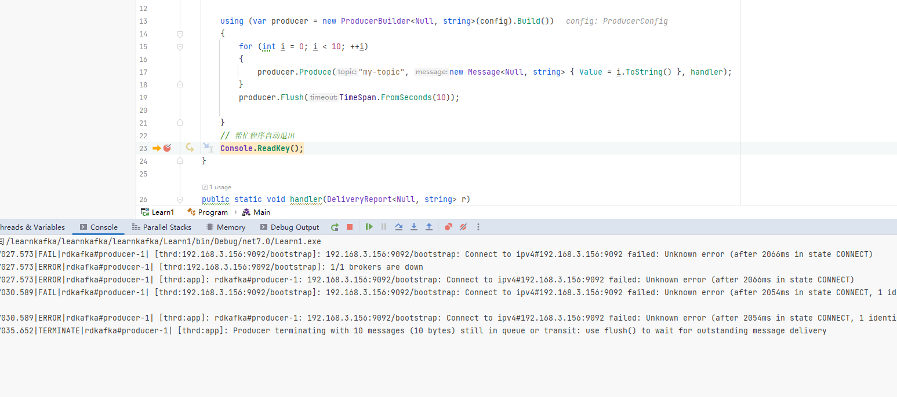
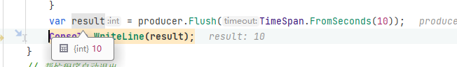
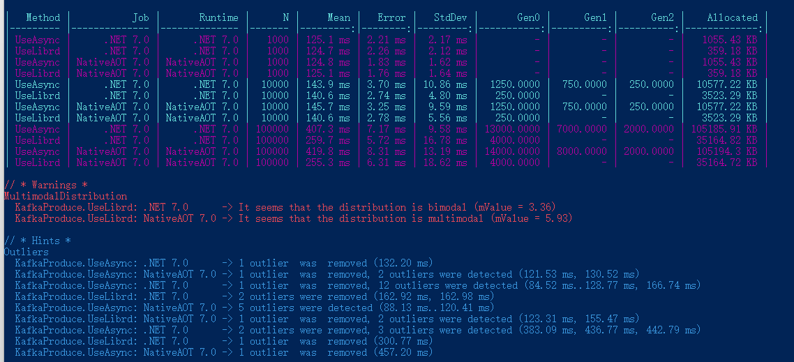

# 3, Kafka .NET 基础

在第一章中，笔者介绍了如何部署 Kafka；在第二章中，笔者介绍了 Kafka 的一些基础知识；在本章中，笔者将介绍如何使用 C# 编写程序连接 kafka，完成生产和消费过程。


在第二章的时候，我们已经使用到了 `confluent-kafka-dotnet` ，通过 `confluent-kafka-dotnet` 编写代码调用 Kafka 的接口，去管理主题。


 `confluent-kafka-dotnet` 其底层使用了一个 C 语言编写的库 librdkafka，其它语言编写的 Kafka 客户端库也是基于 librdkafka 的，基于 librdkafka 开发客户端库，官方可以统一维护底层库，不同的编程语言可以复用代码，还可以利用 C 语言编写的库提升性能。

此外，因为不同的语言都使用了相同的底层库，也使用了相同的接口，因此其编写的客户端库接口看起来也会十分接近。大多数情况下，Java 和 C# 使用 Kafka 的代码是比较相近的。


接着说一下  `confluent-kafka-dotnet`，Github 仓库中对这个库的其中一个特点介绍是：

- **High performance** ： confluent-kafka-dotnet 是一个轻量级的程序包装器，它包含了一个精心调优的 C 语言写的 librdkafka 库。

Library dkafka 是 Apache Kafka 协议的 C 库实现，提供了 Producer、 Consumer 和 Admin 客户端。它的设计考虑到信息传递的可靠性和高性能，目前的性能超过 100万条消息/秒 的生产和 300万条消息/秒 的消费能力（原话是：current figures exceed 1 million msgs/second for the producer and 3 million msgs/second for the consumer）。


现在，这么牛逼的东西，到 nuget 直接搜索 Confluent.Kafka 即可使用。


回归正题，下面笔者将会介绍如果使用 C# 编写生产者、消费者程序。在本章中，我们只需要学会怎么用就行，大概了解过程，而不必深究参数配置，也不必细究代码的功能或作用，在后面的章节中，笔者会详细介绍的。


### 生产者

编写生产者程序大概可以分为两步，第一步是定义 ProducerConfig 配置，里面是关于生产者的各种配置，例如 Broker 地址、发布消息重试次数、缓冲区大小等；第二步是定义发布消息的过程。例如要发布什么内容、如何记录错误消息、如何拦截异常、自定义消息分区等。


下面是生产者代码的示例：

```csharp
using Confluent.Kafka;
using System.Net;

public class Program
{
    static void Main()
    {
        var config = new ProducerConfig
        {
            BootstrapServers = "host1:9092",
            ...
        };

        using (var producer = new ProducerBuilder<Null, string>(config).Build())
        {
            ...
        }
    }
}
```


如果要将消息推送到 Kafka，那么代码是这样写的：

```csharp
var result = await producer.ProduceAsync("weblog", new Message<Null, string> { Value="a log message" });
```

> `Value` 就是消息的内容。其实一条消息的结构比较复杂的，除了 Value ，还有 Key 和各种元数据，这个在后面的章节中我们再讨论。


下面是发布一条消息的实际代码示例：

```csharp
using Confluent.Kafka;
using System.Net;

public class Program
{
    static async Task Main()
    {
        var config = new ProducerConfig
        {
            BootstrapServers = "192.168.3.156:9092"
        };

        using (var producer = new ProducerBuilder<Null, string>(config).Build())
        {
            var result = await producer.ProduceAsync("weblog", new Message<Null, string> { Value = "a log message" });
        }
    }
}
```


运行这段代码后，可以打开 kafdrop 面板查看主题信息。






如果我们断点调试 `ProduceAsync` 后的内容，可以看到有比较多的信息，例如：




这些信息记录了当前消息是否被 Broker 接收并确认(ACK)，该条消息被推送到哪个 Broker 的哪个分区中，消息偏移量数值又是什么。

当然，这里暂时不需要关注这个。


### 批量生产

这一节中，我们来了解如何通过代码批量推送消息到 Broker。

下面是代码示例：

```csharp
using Confluent.Kafka;
using System.Net;

public class Program
{
    static async Task Main()
    {
        var config = new ProducerConfig
        {
            BootstrapServers = "192.168.3.156:9092"
        };

        using (var producer = new ProducerBuilder<Null, string>(config).Build())
        {
            for (int i = 0; i < 10; ++i)
            {
                producer.Produce("my-topic", new Message<Null, string> { Value = i.ToString() }, handler);
            }
        }
        // 帮忙程序自动退出
        Console.ReadKey();
    }

    public static void handler(DeliveryReport<Null, string> r)
    {
        Console.WriteLine(!r.Error.IsError
            ? $"Delivered message to {r.TopicPartitionOffset}"
            : $"Delivery Error: {r.Error.Reason}");
    }
}
```




可以看到，这里批量推送消息使用了 `Produce`，而之前我们使用的异步代码用了 `ProduceAsync`。

其实两者都是异步的，但是 `Product` 方法更直接地映射到底层的 librdkafka API，能够利用 librdkafka 中高性能的接口批量推送消息。而 `ProduceAsync` 则是 C# 实现的异步，相对来说`Product` 的开销小一些，但是 ProduceAsync 仍然非常高性能——在典型的硬件上每秒能够产生数十万条消息


如果说最最直观的差异，那么就是两者的返回结果。

从定义来看：

```csharp
Task<DeliveryResult<TKey, TValue>> ProduceAsync(string topic, Message<TKey, TValue> message, ...);

void Produce(string topic, Message<TKey, TValue> message, Action<DeliveryReport<TKey, TValue>> deliveryHandler = null);
```


`ProduceAsync` 可以直接获得 Task，然后通过等待 Task 获取响应结果。

而 `Produce` 并不能直接获得结果，而是通过回调方式获取推送结果，由 librdkafka 执行回调。


由于 `Produce` 是框架底层异步的，但是没有 Task，所以不能 `await` ，为了避免在批量消息处理完成之前，`producer` 生命周期结束了，所以需要使用 `producer.Flush(TimeSpan.FromSeconds(10))` 这样的代码等待批量消息完成推送。


调用 `Flush` 方法可使所有缓冲记录立即可用于发送，并在与这些记录关联的请求完成时发生阻塞。 

`Flush` 有两个重载：

```csharp
int Flush(TimeSpan timeout);
void Flush(CancellationToken cancellationToken = default(CancellationToken));
```


`int Flush()` 会等待指定的时间，如果时间到了，队列中的消息只发送一部分，那么会返回**没成功发送的消息数量**。


示例代码如下：

```csharp
using Confluent.Kafka;
using System.Net;

public class Program
{
    static async Task Main()
    {
        var config = new ProducerConfig
        {
            BootstrapServers = "192.168.3.156:9092"
        };

        using (var producer = new ProducerBuilder<Null, string>(config).Build())
        {
            for (int i = 0; i < 10; ++i)
            {
                producer.Produce("my-topic", new Message<Null, string> { Value = i.ToString() }, handler);
            }
            // 只等待 10s
            var count = producer.Flush(TimeSpan.FromSeconds(10));
            // 或者使用
            // void Flush(CancellationToken cancellationToken = default(CancellationToken));
        }
        // 不让程序自动退出
        Console.ReadKey();
    }

    public static void handler(DeliveryReport<Null, string> r)
    {
        Console.WriteLine(!r.Error.IsError
            ? $"Delivered message to {r.TopicPartitionOffset}"
            : $"Delivery Error: {r.Error.Reason}");
    }
}
```


如果将 Kafka 服务停止，客户端肯定是不能推送消息的，那么我们在使用批量推送代码时会有什么现象呢？

这里可以停止所有 Broker 或者给 `BootstrapServers` 参数设置一个错误的地址，然后启动程序，会发现 `producer.Flush(TimeSpan.FromSeconds(10));` 会等待 10s，但是此时 handler 不会起效。




可以看到，如果使用批量消息，需要注意使用 `Flush`，即使连接不上 Broker，程序也不会报错。


所以我们使用批量消息时，一定要注意与 Broker 的连接状态，以及处理 `Flush` 返回的失败数量。


```csharp
            var result = producer.Flush(TimeSpan.FromSeconds(10));
            Console.WriteLine(result);
```




### 使用 Tasks.WhenAll

前面提到了使用 `Produce` 方法来批量推送消息，除了框架本身的批量提交，我们也可以利用 `Tasks.WhenAll` 来实现批量提交获取返回结果，不过性能并没有 `produce - Flush` 好。


示例代码如下：

```csharp
        using (var producer = new ProducerBuilder<Null, string>(config).Build())
        {
            List<Task> tasks = new();
            for (int i = 0; i < 10; ++i)
            {
                var task = producer.ProduceAsync("my-topic", new Message<Null, string> { Value = i.ToString() });
                tasks.Add(task);
            }
            await Task.WhenAll(tasks.ToArray());
        }
```


### 如何进行性能测试

`produce - Flush` 的性能到底有多好呢？

我们可以使用 BenchmarkDotNet 做性能测试，来评估推送不同消息数量时，消耗的时间和内存。由于不同服务器的 CPU、内存、磁盘速度，以及客户端与服务器之间的网络带宽、时延都是影响消息吞吐量的重要因素，因此有必要编写代码来进行性能测试，来评估客户端以及服务器需要多高的性能来运行程序。


示例代码如下：

```csharp
using Confluent.Kafka;
using System.Net;
using System.Security.Cryptography;
using BenchmarkDotNet.Attributes;
using BenchmarkDotNet.Running;
using BenchmarkDotNet.Jobs;

public class Program
{
    static void Main()
    {
        var summary = BenchmarkRunner.Run<KafkaProduce>();
    }
}

[SimpleJob(RuntimeMoniker.Net70)]
[SimpleJob(RuntimeMoniker.NativeAot70)]
[RPlotExporter]
public class KafkaProduce
{
    // 每批消息数量
    [Params(1000, 10000,100000)]
    public int N;

    private ProducerConfig _config;
    
    
    [GlobalSetup]
    public void Setup()
    {
        _config = new ProducerConfig
        {
            BootstrapServers = "192.168.3.156:9092"
        };
    }

    [Benchmark]
    public async Task UseAsync()
    {
        using (var producer = new ProducerBuilder<Null, string>(_config).Build())
        {
            List<Task> tasks = new();
            for (int i = 0; i < N; ++i)
            {
                var task = producer.ProduceAsync("ben1-topic", new Message<Null, string> { Value = i.ToString() });
                tasks.Add(task);
            }
            await Task.WhenAll(tasks);
        }
    }

    [Benchmark]
    public void UseLibrd()
    {
        using (var producer = new ProducerBuilder<Null, string>(_config).Build())
        {
            for (int i = 0; i < N; ++i)
            {
                producer.Produce("ben2-topic", new Message<Null, string> { Value = i.ToString() }, null);
            }
            producer.Flush(TimeSpan.FromSeconds(60));
        }
    }
}
```

> 在示例代码中，笔者除了记录时间速度外，也开启了 GC 记录。


Ping 服务器的结果以及 BenchmarkDotNet 性能测试结果如下：

```
正在 Ping 192.168.3.156 具有 32 字节的数据:
来自 192.168.3.156 的回复: 字节=32 时间=1ms TTL=64
来自 192.168.3.156 的回复: 字节=32 时间=2ms TTL=64
来自 192.168.3.156 的回复: 字节=32 时间=2ms TTL=64
来自 192.168.3.156 的回复: 字节=32 时间=1ms TTL=64
```

| Method   | Job           | Runtime       | N      |     Mean |   Error |   StdDev |       Gen0 |      Gen1 |      Gen2 |    Allocated |
| -------- | ------------- | ------------- | ------ | -------: | ------: | -------: | ---------: | --------: | --------: | -----------: |
| UseAsync | .NET 7.0      | .NET 7.0      | 1000   | 125.1 ms | 2.21 ms |  2.17 ms |          - |         - |         - |   1055.43 KB |
| UseLibrd | .NET 7.0      | .NET 7.0      | 1000   | 124.7 ms | 2.26 ms |  2.12 ms |          - |         - |         - |    359.18 KB |
| UseAsync | NativeAOT 7.0 | NativeAOT 7.0 | 1000   | 124.8 ms | 1.83 ms |  1.62 ms |          - |         - |         - |   1055.43 KB |
| UseLibrd | NativeAOT 7.0 | NativeAOT 7.0 | 1000   | 125.1 ms | 1.76 ms |  1.64 ms |          - |         - |         - |    359.18 KB |
| UseAsync | .NET 7.0      | .NET 7.0      | 10000  | 143.9 ms | 3.70 ms | 10.86 ms |  1250.0000 |  750.0000 |  250.0000 |  10577.22 KB |
| UseLibrd | .NET 7.0      | .NET 7.0      | 10000  | 140.6 ms | 2.74 ms |  4.80 ms |   250.0000 |         - |         - |   3523.29 KB |
| UseAsync | NativeAOT 7.0 | NativeAOT 7.0 | 10000  | 145.7 ms | 3.25 ms |  9.59 ms |  1250.0000 |  750.0000 |  250.0000 |  10577.22 KB |
| UseLibrd | NativeAOT 7.0 | NativeAOT 7.0 | 10000  | 140.6 ms | 2.78 ms |  5.56 ms |   250.0000 |         - |         - |   3523.29 KB |
| UseAsync | .NET 7.0      | .NET 7.0      | 100000 | 407.3 ms | 7.17 ms |  9.58 ms | 13000.0000 | 7000.0000 | 2000.0000 | 105185.91 KB |
| UseLibrd | .NET 7.0      | .NET 7.0      | 100000 | 259.7 ms | 5.72 ms | 16.78 ms |  4000.0000 |         - |         - |  35164.82 KB |
| UseAsync | NativeAOT 7.0 | NativeAOT 7.0 | 100000 | 419.8 ms | 8.31 ms | 13.19 ms | 14000.0000 | 8000.0000 | 2000.0000 |  105194.3 KB |
| UseLibrd | NativeAOT 7.0 | NativeAOT 7.0 | 100000 | 255.3 ms | 6.31 ms | 18.62 ms |  4000.0000 |         - |         - |  35164.72 KB |




可以看到使用了 librdkafka 批量推送，比使用 `Task.WhenAll` 性能要好一些，特别是消息数量比较大的情况下。


不过这个性能测试的结果意义也不大，主要是让读者了解如何使用 BenchmarkDotNet 进行性能测试，客户端推送消息到 Broker，能够实现每秒多大的负载，以此评估在当前环境下可以承载多大的流量。


### 消费

生产消息后，接着编写消费者程序处理消息，消费的代码分为 `ConsumerConfig` 配置和消费两步，其示例代码如下：


```csharp
using System.Collections.Generic;
using Confluent.Kafka;

...

var config = new ConsumerConfig
{
    // 这些配置后面的章节中笔者会介绍，这里跳过。
    BootstrapServers = "host1:9092,host2:9092",
    GroupId = "foo",
    AutoOffsetReset = AutoOffsetReset.Earliest
};

using (var consumer = new ConsumerBuilder<Ignore, string>(config).Build())
{
    ...
}
```


消费者配置默认会自动提交确认(ACK)，所以消费后不需要编写代码确认消息，所以笔者编写的消费者示例代码如下：

```csharp
using Confluent.Kafka;
using System.Net;

public class Program
{
    static void Main()
    {
        var config = new ConsumerConfig
        {
            BootstrapServers = "192.168.3.156:9092",
            GroupId = "test1",
            AutoOffsetReset = AutoOffsetReset.Earliest
        };

        CancellationTokenSource source = new CancellationTokenSource();
        using (var consumer = new ConsumerBuilder<Ignore, string>(config).Build())
        {
            // 订阅主题
            consumer.Subscribe("my-topic");
            
            // 循环消费
            while (!source.IsCancellationRequested)
            {
                var consumeResult = consumer.Consume(source.Token);
                Console.WriteLine(consumeResult.Message.Value);
            }

            consumer.Close();
        }
    }
}
```


在本章中，关于 Kafka .NET 的基础就到这里，接下来笔者会详细讲解生产者和消费者的代码编写方法以及各种参数配置的使用方法。
