# 4,客户端的使用

在第三章中，我们学习到了 Kafka C# 客户端的一些使用方法。


## 生产者

```csharp
using Confluent.Kafka;
using System.Net;

public class Program
{
    static void Main()
    {
        var config = new ProducerConfig
        {
            BootstrapServers = "host1:9092",
            ...
        };

        using (var producer = new ProducerBuilder<Null, string>(config).Build())
        {
            ...
        }
    }
}
```


首先是 BootstrapServers，填写所有 Broker 的服务器地址，格式如下：

```
host1:9092,host2:9092,...
```


```csharp
        var config = new ProducerConfig
        {
            BootstrapServers = "<your-IP-port-pairs>",
            SslCaLocation = "/Path-to/cluster-ca-certificate.pem",
            SecurityProtocol = SecurityProtocol.SaslSsl,
            SaslMechanism = SaslMechanism.ScramSha256,
            SaslUsername = "ickafka",
            SaslPassword = "yourpassword",
        };
```


### Key 分区

背景如下：

提前创建了一个 hello-topic ，并设置了两个分区，其创建方式使用第二章的命令。

> ```
> kafka-topics --create --bootstrap-server 192.168.3.158:19092 \
> --replication-factor 2 \
> --partitions 3 \
> --topic hello-topic
> ```


```
public class ProducerBuilder<TKey, TValue>
```

```
    public class Message<TKey, TValue> : MessageMetadata
    {
        //
        // 摘要:
        //     Gets the message key value (possibly null).
        public TKey Key { get; set; }

        //
        // 摘要:
        //     Gets the message value (possibly null).
        public TValue Value { get; set; }
    }
```


```csharp
    static async Task Main()
    {
        var config = new ProducerConfig
        {
            BootstrapServers = "192.168.3.158:19092,192.168.3.158:29092,192.168.3.158:39092"
        };
        using (var producer = new ProducerBuilder<int, string>(config).Build())
        {
            var r1 = await producer.ProduceAsync("hello-topic", new Message<int, string> { Key = 1, Value = "a log message" });
            var r2 = await producer.ProduceAsync("hello-topic", new Message<int, string> { Key = 2, Value = "a log message" });
            var r3 = await producer.ProduceAsync("hello-topic", new Message<int, string> { Key = 3, Value = "a log message" });
            var r4 = await producer.ProduceAsync("hello-topic", new Message<int, string> { Key = 4, Value = "a log message" });
            Console.WriteLine($"""
                r1  Status:{r1.Status},Partition:{r1.Partition}
                r2  Status:{r2.Status},Partition:{r2.Partition}
                r3  Status:{r3.Status},Partition:{r3.Partition}
                r4  Status:{r4.Status},Partition:{r4.Partition}
                """);
        }
    }
```

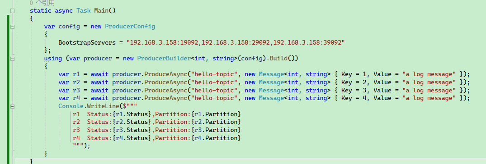

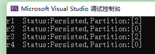


如果 Broker 有三个，但是我只填写了一个 Broker 呢？


下面再来看新的示例。


客户端只填写了一个 BootstrapServers 地址。


```csharp
    static async Task Main()
    {
        var config = new ProducerConfig
        {
            BootstrapServers = "192.168.3.158:19092"
        };
        using (var producer = new ProducerBuilder<string, string>(config).Build())
        {
            var r1 = await producer.ProduceAsync("hello-topic", new Message<string, string> { Key = "a", Value = "a log message" });
            var r2 = await producer.ProduceAsync("hello-topic", new Message<string, string> { Key = "b", Value = "a log message" });
            var r3 = await producer.ProduceAsync("hello-topic", new Message<string, string> { Key = "c", Value = "a log message" });
            var r4 = await producer.ProduceAsync("hello-topic", new Message<string, string> { Key = "d", Value = "a log message" });
            Console.WriteLine($"""
                r1  Status:{r1.Status},Partition:{r1.Partition}
                r2  Status:{r2.Status},Partition:{r2.Partition}
                r3  Status:{r3.Status},Partition:{r3.Partition}
                r4  Status:{r4.Status},Partition:{r4.Partition}
                """);
        }
    }
```

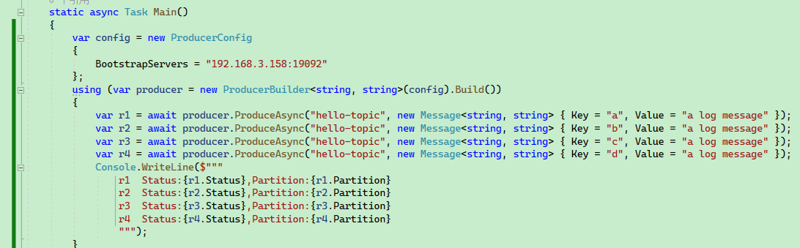

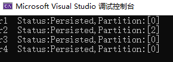


可以看到，依然可以被正确分区。


接下来还有一个疑问，

如果向 Broker 的一个分区，推送具有相同值的 Key，那么会覆盖之前的消息？

答案是不会。

首先向 Broker 推送 20 条消息。

```csharp
    static async Task Main()
    {
        var config = new ProducerConfig
        {
            BootstrapServers = "192.168.3.158:19092",
        };
        using (var producer = new ProducerBuilder<string, string>(config)
            .Build())
        {
            int i = 1;
            while (i <= 10)
            {
                var r1 = await producer.ProduceAsync("same-hello", new Message<string, string> { Key = i.ToString(), Value = "1" });
                Console.WriteLine($"id:{r1.Key},status:{r1.Status}");
                i++;
            }

            i = 1;
            while (i <= 10)
            {
                var r1 = await producer.ProduceAsync("same-hello", new Message<string, string> { Key = i.ToString(), Value = "2" });
                Console.WriteLine($"id:{r1.Key},status:{r1.Status}");
                i++;
            }
        }
    }
```

> 或者：
>
> ```csharp
>             int i = 1;
>             while (i <= 10)
>             {
>                 var r1 = await producer.ProduceAsync("same-hello", new Message<string, string> { Key = i.ToString(), Value = "1" });
>                 Console.WriteLine($"id:{r1.Key},status:{r1.Status}");
>                 var r2 = await producer.ProduceAsync("same-hello", new Message<string, string> { Key = i.ToString(), Value = "2" });
>                 Console.WriteLine($"id:{r1.Key},status:{r2.Status}");
>                 i++;
>             }
> ```
>
> 


```
id:1,status:Persisted
id:2,status:Persisted
id:3,status:Persisted
id:4,status:Persisted
id:5,status:Persisted
id:6,status:Persisted
id:7,status:Persisted
id:8,status:Persisted
id:9,status:Persisted
id:10,status:Persisted
id:1,status:Persisted
id:2,status:Persisted
id:3,status:Persisted
id:4,status:Persisted
id:5,status:Persisted
id:6,status:Persisted
id:7,status:Persisted
id:8,status:Persisted
id:9,status:Persisted
id:10,status:Persisted
```

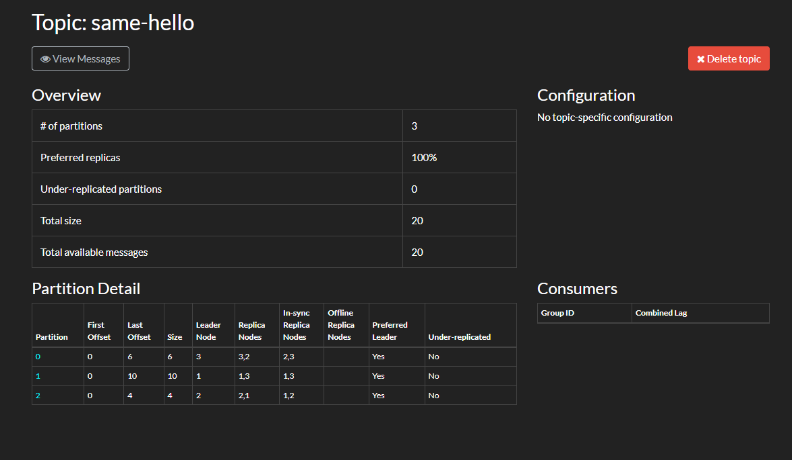


可以看到，消息数量确实为 20 条，虽然部分 key 重复，但是消息还在，不会丢失。

打开其中一个分区，会发现分区器依然是正常工作，相同的 key 依然会被划分到同一个分区中。

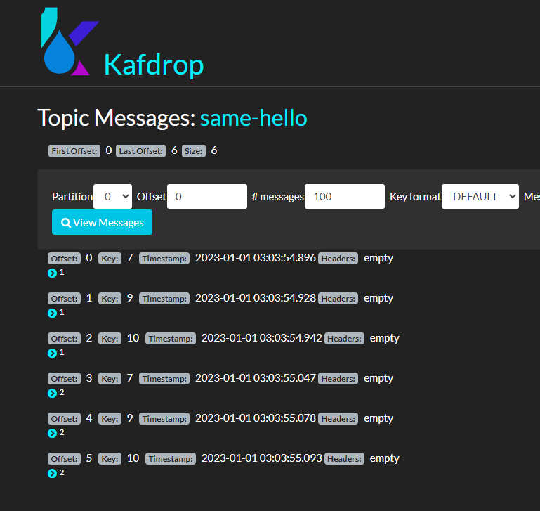


### 生产者配置

查看 ProducerConfig 的源码可以发现，每个属性字段都对应了一个 Kafka 配置项。

本节主要参考文章：https://towardsdatascience.com/10-configs-to-make-your-kafka-producer-more-resilient-ec6903c63e3f

https://hevodata.com/learn/kafka-producer-config/

部分图片来源于此文章。

本节介绍生产者的以下配置：

- `acks`
- `bootstrap.servers`
- `retries`
- `enable.idempotence`
- `max.in.flight.requests.per.connection`
- `buffer.memory`
- `max.block.ms`
- `linger.ms`
- `batch.size`
- `compression.type`


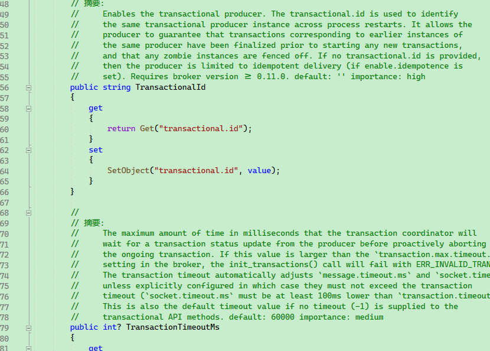

完整的生产者配置文档：https://docs.confluent.io/platform/current/installation/configuration/producer-configs.html#

不同的编程语言对生产者的封装不一样。


* key.serializer、value.serializer：Message 的 Key、Value 序列化器；
* bootstrap.servers：集群地址，只需要配置部分 Broker 即可；

详细每个配置的信息可以参考第五章。


#### acks

```
    public enum Acks
    {
        None = 0,
        Leader = 1,
        All = -1
    }
```


Acks 表示生产者在考虑成功提交之前需要领导代理收到的确认数量。这有助于控制发送的消息的持久性。下面是一些常用的卡夫卡生产者配置设置:

- `acks=0`**:** 将 acks 设置为0意味着生产者根本不会从服务器获得任何确认。这意味着该记录将立即添加到套接字缓冲区并被视为已发送
- `acks=1`**:** 这意味着，只要生产者收到领导代理的确认，它就会将其视为成功的提交
- `acks=all`:  这意味着制作者在考虑成功提交之前必须等待来自该主题的所有同步副本的确认。它提供了最强大的可用消息持久性

默认值为1，这意味着只要生产者从该主题的领导代理收到 ack，它就会将其视为成功的提交并继续下一条消息。建议不要设置 acks = 0，因为这样就不能保证提交。Acks = all 将确保生产者从该主题的所有同步副本中获得 acks。它提供了最强的消息持久性，但是它也需要较长的时间，从而导致较高的延迟。所以，你需要决定什么对你来说更重要。

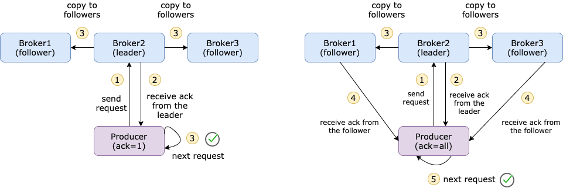

【图源：https://towardsdatascience.com/10-configs-to-make-your-kafka-producer-more-resilient-ec6903c63e3f】


#### bootstrap.servers

erver 表示用于建立到 Kafka 集群的初始连接的主机/端口对列表。该列表不需要包含完整的服务器集，因为它们仅用于建立初始连接以标识完整的集群成员身份。清单应采用下列格式:

```
host1:port1,host2:port2,....
```


#### retries

默认情况下，如果提交失败，生产者不会重新发送记录。但是，可以将生成器配置为使用 retry = n 重新发送消息“ n”许多次。 retry 基本上表示在提交失败时生成器将重试的最大次数。默认值为0。

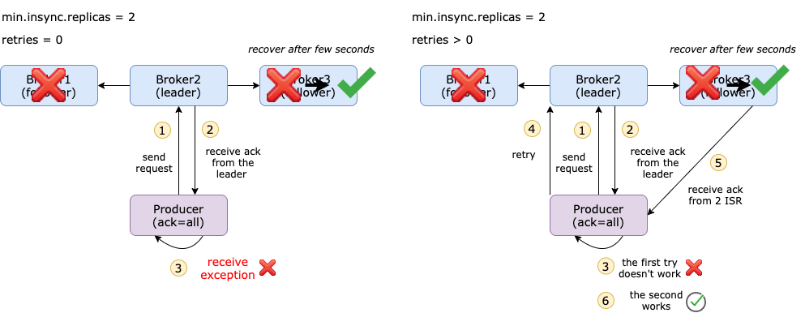

【图源：https://towardsdatascience.com/10-configs-to-make-your-kafka-producer-more-resilient-ec6903c63e3f】

如果设置 retry = 5，那么生产者将最多重试5次。您不会注意到来自生产者日志的重试次数，因为它只显示提交是否成功或最终不成功。但是您可以在代理端看到重试 + 1日志消息。


要注意，C# 中的命名有些差别，例如重试字段属性名称：

```
        public int? MessageSendMaxRetries
        {
            get
            {
                return GetInt("message.send.max.retries");
            }
            set
            {
                SetObject("message.send.max.retries", value);
            }
        }
```


#### enable.idempotence

简单地说，幂等性是某些操作在不改变结果的情况下多次应用的性质。当打开时，生产者将确保只有一个记录副本被发布到流。默认值为 false，这意味着生产者可以将消息的副本写入流。要打开幂等函数，请使用下面的命令

```
enable.idempotent=true
```


在某些情况下，消息实际上已经提交给所有同步副本，但由于网络问题，代理无法发送回一个 ack (例如，只允许单向通信)。同时，我们设置 retry = 3，然后生成器将重新发送消息3次。这可能导致主题中出现重复消息。

最理想的情况是精确一次语义，即使生产者重新发送消息，使用者也应该只收到相同的消息一次。

它是怎么工作的？消息以批处理方式发送，每个批处理都有一个序号。在代理端，它跟踪每个分区的最大序列号。如果进入一个序列号较小或相等的批处理，代理将不会将该批处理写入主题。通过这种方式，它还可以确保批次的顺序。

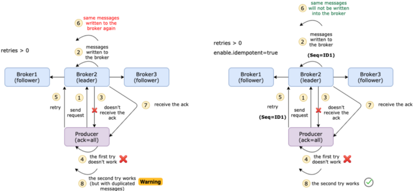

【图源：https://towardsdatascience.com/10-configs-to-make-your-kafka-producer-more-resilient-ec6903c63e3f】


#### max.in.flight.requests.per.connection

Connection Kafka Producer Config 表示客户机在阻塞之前在单个连接上发送的未确认请求的最大数量。默认值为5。

如果启用了重试，并且 max.in.flight.requests.per.connect 设置为大于1，则存在消息重新排序的风险。

确保顺序的另一个重要配置是 max.in.flight.requests.per.connect，默认值为5。这表示可以在生产者端缓冲的未确认请求的数量。如果重试次数大于1，第一个请求失败，但第二个请求成功，那么第一个请求将被重试，消息的顺序将错误。

*请注意，如果此设置大于1，并且发送失败，则由于重试(即，如果启用了重试) ，存在消息重新排序的风险。*

如果没有设置 `enable.idempotent=true`，但仍希望保持消息的顺序，则应将此设置配置为1。

但是如果已经启用了  `enable.idempotent=true`，那么就不需要显式定义这个配置。卡夫卡将选择适当的值，正如这里所述。


#### buffer.memory

Memory 表示生产者可以用来缓冲等待发送到服务器的记录的总内存字节数。内存的默认值是32 MB。如果生产者发送记录的速度快于它们传送到服务器的速度，那么将超出 Buffer.memory，生产者将为 max.lock.ms (下面讨论)阻止它们，因此它将抛出一个异常。Memory 设置应该大致对应于生成器使用的总内存。

Ms 基本上定义了生产者阻止 KafkaProducer.send ()和 KafkaProducer.parttionsFor ()的最大持续时间。每当超出 Buffer.memory 或元数据不可用时，都可以阻塞这些方法。

当生产者调用 send ()时，不会立即发送消息，而是将其添加到内部缓冲区中。内存的默认值是32 MB。如果生产者发送消息的速度比它们传输到代理的速度快，或者出现网络问题，那么 send ()调用将被阻塞到 max.lock.ms (默认为1分钟)。

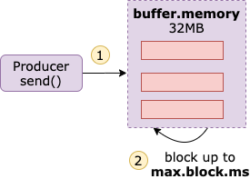

【图源：https://towardsdatascience.com/10-configs-to-make-your-kafka-producer-more-resilient-ec6903c63e3f】

Another 2 configs that you can play around with are `linger.ms` and `batch.size`. `linger.ms` is the delay time before the batches are ready to be sent. The default value is 0 which means batches will be immediately sent even if there is only 1 message in the batch. Sometimes, people increase `linger.ms` to reduce the number of requests and improve throughput. But this will lead to more messages kept in memory. So, make sure that you take care of both sides.

另外两个可以使用的配置是 linger.ms 和 batch.size。Ms 是批准发送之前的延迟时间。默认值为0，这意味着即使批中只有1条消息，也会立即发送批处理。有时，人们增加 linger.ms 以减少请求数量并提高吞吐量。但这将导致更多的信息保存在内存中。所以，确保你照顾好双方。

There is an equivalent configuration as `linger.ms`, which is `batch.size`. This is the maximum size of a single batch. Batches will be sent when any of these 2 requirements are fulfilled.

有一个与 linger.ms 等价的配置，即 batch.size。这是单个批处理的最大大小。当满足这两个要求中的任何一个时，批量将被发送。

#### batch.size

Whenever multiple records are sent to the same partition, the producer attempts to batch the records together. This way, the performance of both the client and the server can be improved. `batch.size` represents the maximum size (in bytes) of a single batch.

每当多条记录被发送到同一个分区时，生产者就会尝试将这些记录批处理在一起。通过这种方式，可以提高客户机和服务器的性能。Size 表示单个批处理的最大大小(以字节为单位)。

Small batch size will make batching irrelevant and will reduce throughput, and a very large batch size will lead to memory wastage as a buffer is usually allocated in anticipation of extra records.

小批量将使批处理无关紧要，并将降低吞吐量，而且非常大的批处理大小将导致内存浪费，因为缓冲区通常是在预期额外记录的情况下分配的。

#### compression.type

`compression.type` signifies the compression type for all data generated by the producer. The default value is `none` which means there is no compression. You can further set the `compression.type` to `gzip`, `snappy`, or `lz4`.

Type 表示生成器生成的所有数据的压缩类型。默认值是 no，这意味着没有压缩。您可以进一步将 pression.type 设置为 gzip、 snappy 或 lz4。


### 生产者拦截器

Library dkafka 有一个拦截器 API，但是您需要用 C 编写它们，并且不能轻松地从 C # 代码中共享状态。

https://github.com/confluentinc/confluent-kafka-dotnet/issues/1454


### 序列化器

有 Key 和 Value 两种序列化器。

```
            .SetKeySerializer(...)
            .SetValueSerializer(...)
```

基本上，ApacheKafka 提供了我们可以轻松发布和订阅记录流的能力。因此，我们可以灵活地创建自己的定制序列化程序和反序列化程序，这有助于使用它传输不同的数据类型。

但是，将对象转换为字节流以进行传输的过程称为序列化(Serialization)。尽管如此，ApacheKafka 在其队列中存储并传输这些字节数组。

然而，序列化的对立面是反序列化。在这里，我们将数组的字节转换为所需的数据类型。但是，确保 Kafka 只为少数几种数据类型提供序列化器和反序列化器，例如

- String 绳子
- Long 很长
- Double 双倍
- Integer 整数
- Bytes 字节

换句话说，在将整个消息传输给代理之前，让生产者知道如何使用序列化器将消息转换为字节数组。类似地，要将字节数组转换回对象，使用者使用反序列化器。


在 C# 中，Serializers 定义了几个默认的序列化器。

```
Utf8
Null
Int64
Int32
Single
Double
ByteArray
```


由于 byte[] 转对应的类型并不复杂，因此这里将部分序列化器的源码显示出来：

```csharp
        private class Utf8Serializer : ISerializer<string>
        {
            public byte[] Serialize(string data, SerializationContext context)
            {
                if (data == null)
                {
                    return null;
                }

                return Encoding.UTF8.GetBytes(data);
            }
        }

        private class NullSerializer : ISerializer<Null>
        {
            public byte[] Serialize(Null data, SerializationContext context)
            {
                return null;
            }
        }

        private class Int32Serializer : ISerializer<int>
        {
            public byte[] Serialize(int data, SerializationContext context)
            {
                return new byte[4]
                {
                    (byte)(data >> 24),
                    (byte)(data >> 16),
                    (byte)(data >> 8),
                    (byte)data
                };
            }
        }
```


如果需要支持更多类型，则可以继承 `ISerializer<T>` 来实现。


由于 C# 有泛型，因此在使用 `new ProducerBuilder<TKey, TValue>` 的时候，会自动从默认的几种序列化器中找到合适的  `ISerializer<T>` ，如果不是默认的这几种类型，则需要自行实现序列化器。


生产者设置了对应的序列化器，客户端同样可以设置对应的反序列化器，以便能够正确从 Message 中还原对应的结构。

同样，有这几种默认的反序列化器，在 `Deserializers` 中可以找到，因为生产者、消费者这部分配置是关联相通的，因此后面讲解消费者的时候，就不提及了。

```csharp
        using (var consumer = new ConsumerBuilder<Ignore, string>(config)
            .SetKeyDeserializer(Deserializers.Ignore)
            .Build())
            {
            
            }
```


### 生产者处理器

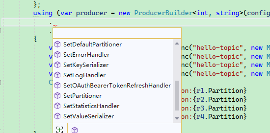

```bash
SetStatisticsHandler
SetKeySerializer
SetValueSerializer
SetPartitioner
SetDefaultPartitioner
SetErrorHandler
SetLogHandler
```


#### Statistics 统计数据

https://github.com/confluentinc/librdkafka/blob/master/STATISTICS.md

librdkafka may be configured to emit internal metrics at a fixed interval by setting the `statistics.interval.ms` configuration property to a value > 0 and registering a `stats_cb` (or similar, depending on language).

通过将 statistics.interval.ms 配置属性设置为值 > 0并注册 stats _ cb (或类似的，取决于语言) ，library dkafka 可以配置为以固定的时间间隔发出内部指标。


首先修改生产者配置中的 StatisticsIntervalMs 属性

```csharp
        var config = new ProducerConfig
        {
            BootstrapServers = "192.168.3.158:19092",
            StatisticsIntervalMs = 1000,
        };
```


然后使用 SetStatisticsHandler 设置处理器，`Action<IProducer<TKey, TValue>, string> statisticsHandler`

委托中一共有两个参数变量，前者 `IProducer<TKey, TValue>` 就是当前生产者实例，后者 `string` 是 Json 文本，记录了当前所有 Broker 的所有详细信息。

由于表示的内容很多，读者可以参考:

https://github.com/confluentinc/librdkafka/blob/master/STATISTICS.md

使用实例如下：

```csharp
    static async Task Main()
    {
        var config = new ProducerConfig
        {
            BootstrapServers = "192.168.3.158:19092,192.168.3.158:29092,192.168.3.158:39092",
            StatisticsIntervalMs = 1000,
        };
        using (var producer = new ProducerBuilder<int, string>(config)
            .SetStatisticsHandler((producer, json) =>
            {
                Console.WriteLine(producer.Name);
                Console.WriteLine(json);
            })
            .Build())
        {
            int i = 100;
            while (true)
            {
                Thread.Sleep(1000);
                var r1 = await producer.ProduceAsync("hello-topic", new Message<int, string> { Key = i, Value = "a log message" });
                i++;
            }
        }
    }
```


#### SetPartitioner、SetDefaultPartitioner

由于指定生产者在向 Broker 推送消息时，消息向指定分区写入。

`SetPartitioner` 的定义如下：

```csharp
SetPartitioner:
SetPartitioner(string topic, PartitionerDelegate partitioner)

-- PartitionerDelegate:
   Partition PartitionerDelegate(string topic, int partitionCount, ReadOnlySpan<byte> keyData, bool keyIsNull);
```


`SetDefaultPartitioner` 的定义如下：

```csharp
SetDefaultPartitioner(PartitionerDelegate partitioner)
```


SetPartitioner、SetDefaultPartitioner 的区别在于 SetPartitioner 可以对指定的 topic 有效，SetDefaultPartitioner  则对当前生产者中的所有 topic 有效。

代码示例如下：

```csharp
    static async Task Main()
    {
        var config = new ProducerConfig
        {
            BootstrapServers = "192.168.3.158:19092,192.168.3.158:29092,192.168.3.158:39092",
            StatisticsIntervalMs = 1000,
        };
        using (var producer = new ProducerBuilder<int, string>(config)
            .SetPartitioner("hello-topic", (topic, partitionCount, keyData, keyIsNull) =>
            {
                return new Partition(0);
            })
            .SetDefaultPartitioner((topic, partitionCount, keyData, keyIsNull) =>
            {
                return new Partition(0);
            })
            .Build())
        {
            int i = 100;
            while (true)
            {
                Thread.Sleep(1000);
                var r1 = await producer.ProduceAsync("hello-topic", new Message<int, string> { Key = i, Value = "a log message" });
                i++;
            }
        }
    }
```


可以看到，现在所有 topic 都向指定的分区 0 写入：

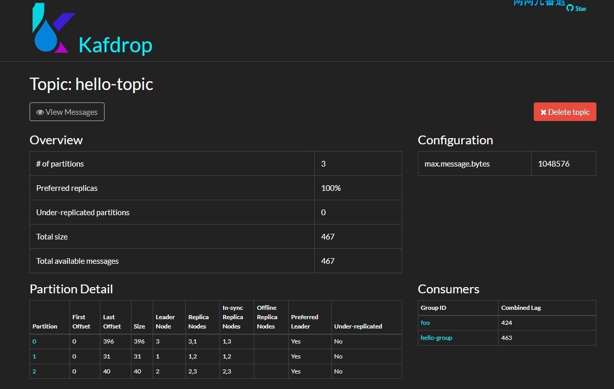


剩下的两个 `SetErrorHandler`、`SetLogHandler`，用于记录错误日志、普通日志，读者可根据其它资料自行实验，这里笔者就不再赘述了。

```csharp
        using (var producer = new ProducerBuilder<int, string>(config)
            .SetErrorHandler((p, err) =>
            {
                Console.WriteLine($"Producer Name:{p.Name},error:{err}");
            })
            .SetLogHandler((p, log) =>
            {
                Console.WriteLine($"Producer Name:{p.Name},log messagge:{JsonSerializer.Serialize(log)}");
            })
            .Build())
        {
            
        }
```


### Broker 限制速率

在 Kafka 中，生产者、消费者都是客户端，两者都有一个 `client.id`，消费者还有一个消费者组的概念，但生产者只有 `client.id`，没有其它标识了。

一般来说，并不需要设定 生产者的 `client.id`，框架会自动设置，如：

```
rdkafka#producer-1
```


```
        var config = new ProducerConfig
        {
            BootstrapServers = "192.168.3.158:19092",
            StatisticsIntervalMs = 1000,
            ClientId = "abcdef"
        };
```


新的 `client.id`：

```
abcdef#producer-1
```


回归正题，在 Kafka 中，可以根据 `client.id` ，对生产者或消费者进行限制流量，多个客户端(消费者或生产者)可以用同一个 `client.id`。或者通过其它认证机制标识客户端身份。

user

client id

user + client id

笔者选择使用最简单的 `client.id` 做实验。

```bash
kafka-configs --alter --bootstrap-server 192.168.3.158:19092 --add-config 'producer_byte_rate=1024,consumer_byte_rate=1024' --entity-type clients --entity-name 'abcdef'
```


然后编写使用下面的代码测试，会发现推送消息速度变得很慢。

```csharp
    static async Task Main()
    {
        var config = new ProducerConfig
        {
            BootstrapServers = "192.168.3.158:19092,192.168.3.158:29092,192.168.3.158:39092",
            StatisticsIntervalMs = 1000,
            ClientId = "abcdef"
        };
        using (var producer = new ProducerBuilder<int, string>(config)
            .Build())
        {
            int i = 1000;
            var str = string.Join(",", Enumerable.Range(0, 1024).Select(x => x.ToString("X16")));
            while (true)
            {
                var r1 = await producer.ProduceAsync("hello-topic", new Message<int, string> { Key = i, Value = str });
                i++;
                Console.WriteLine($"id:{r1.Key},status:{r1.Status}");
            }
        }
    }
```


