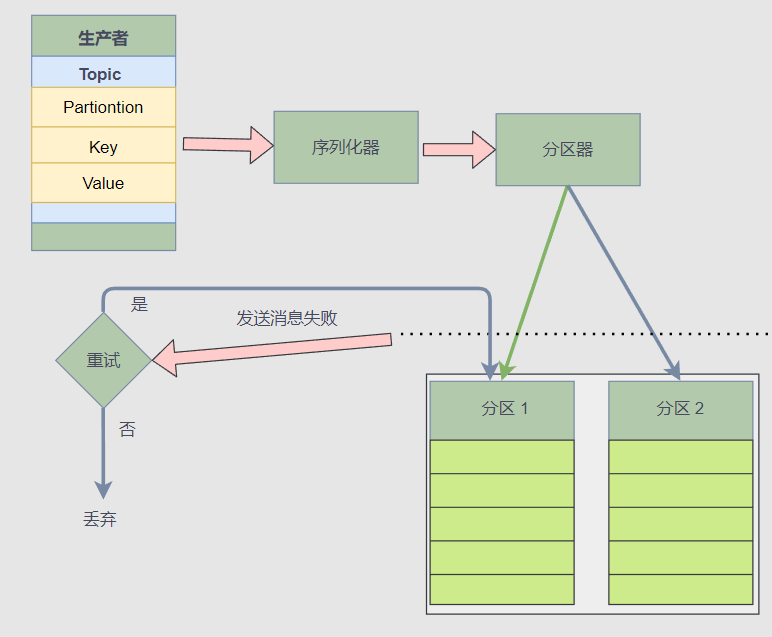
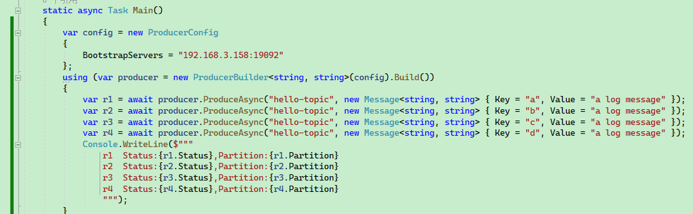
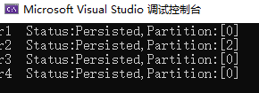
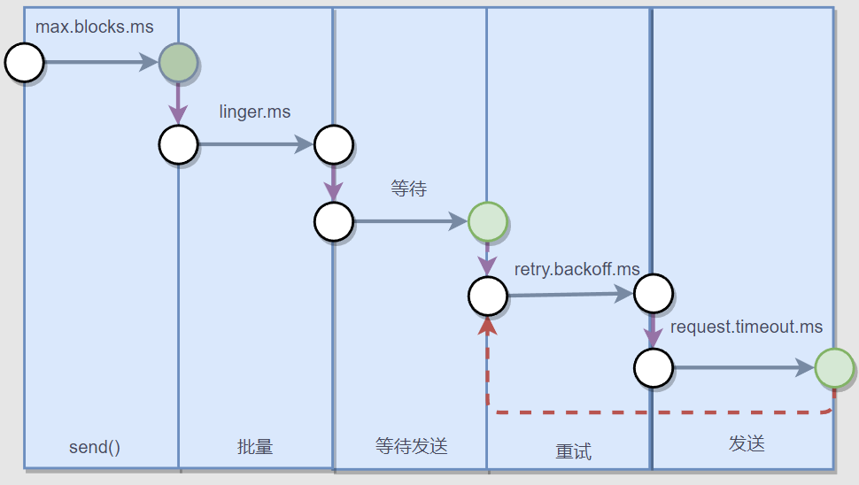

# 4,生产者

在第三章中，我们学习到了 Kafka C# 客户端的一些使用方法，学习了如何编写生产者程序。

在本章中，笔者将会详细介绍生产者程序的参数配置、接口使用方法，以便在项目中更加好地应用 Kafka，以及应对可能发生的故障。


下图是一个生产者推送消息的流程：




使用客户端库编写生产者是比较简单的，但是消息推送过程是比较复杂的，从上图中可以看到生产者推送消息时，客户端库会先用序列化器将消息序列化为二进制，然后通过分区器算出 Topic 的消息需要推送到哪个 Broker 、哪个分区中 。

接着，如果推送消息失败，那么客户端库还要确认是否重试，重试次数、时间间隔等。


所以说，推送消息虽然很简单，但是怎么处理故障，确保消息不会丢失，还有生产者的配置，这些都需要开发者根据场景考虑，设计合理的生产者程序逻辑。

> 就 “避免消息丢失” 这个话题来说，除了生产者需要关注消息是否已经推送到 Broker，还要关注 leader 副本是否及时与 follwer 副本同步。否则即使客户端已经将消息推送到 Broker，Broker 的 leader 还没有同步最新的消息到 follwer 副本就挂了，那么此条消息还是会丢失的，所以客户端还需要设置合理的 ACK。
>
> 说明了消息会不会丢失，不仅跟生产者的状态有关，还跟 Broker 状态有关。 


下面笔者将详细介绍生产者推送消息时，一些日常开发中会遇到的配置以及细节。


### 连接 Broker

生产者连接 Broker，需要定义 ProducerConfig ，首先是 BootstrapServers 属性，填写所有 Broker 的服务器地址，格式如下：

```
host1:9092,host2:9092,...
```


```csharp
using Confluent.Kafka;
using System.Net;

public class Program
{
    static void Main()
    {
        var config = new ProducerConfig
        {
            BootstrapServers = "host1:9092",
            ...
        };
        ... ...
    }
}
```


如果需要通过加密连接，ProducerConfig  可以参考下面的代码：

```csharp
        var config = new ProducerConfig
        {
            BootstrapServers = "<your-IP-port-pairs>",
            SslCaLocation = "/Path-to/cluster-ca-certificate.pem",
            SecurityProtocol = SecurityProtocol.SaslSsl,
            SaslMechanism = SaslMechanism.ScramSha256,
            SaslUsername = "ickafka",
            SaslPassword = "yourpassword",
        };
```


客户端并不需要填写所有 Broker 的地址，因为生产者在建立连接之后，便可以从已连接的 Broker 中查找集群信息，获取到所有 Broker 地址。但是建议至少填写两个 Broker 地址，因为如果第一个 Broker 地址不可用，客户端还可以从其它 Broker 中获取当前集群的信息，不至于完全连不上服务器。


例如服务器有三个 Broker，客户端只填写了一个 BootstrapServers 地址，然后客户端推送消息，这些消息还是会被自动推送到对应的分区中的。


```csharp
    static async Task Main()
    {
        var config = new ProducerConfig
        {
            BootstrapServers = "192.168.3.158:19092"
        };
        using (var producer = new ProducerBuilder<string, string>(config).Build())
        {
            var r1 = await producer.ProduceAsync("hello-topic", new Message<string, string> { Key = "a", Value = "a log message" });
            var r2 = await producer.ProduceAsync("hello-topic", new Message<string, string> { Key = "b", Value = "a log message" });
            var r3 = await producer.ProduceAsync("hello-topic", new Message<string, string> { Key = "c", Value = "a log message" });
            var r4 = await producer.ProduceAsync("hello-topic", new Message<string, string> { Key = "d", Value = "a log message" });
            Console.WriteLine($"""
                r1  Status:{r1.Status},Partition:{r1.Partition}
                r2  Status:{r2.Status},Partition:{r2.Partition}
                r3  Status:{r3.Status},Partition:{r3.Partition}
                r4  Status:{r4.Status},Partition:{r4.Partition}
                """);
        }
    }
```






可以看到，即使只填写一个 Broker，消息依然可以被正确分区。


### Key 分区

本节会介绍 Key 的使用方法。


提前创建了一个 hello-topic 主题，并设置了 3 个分区，3 个副本，其创建命令如下所示：

````bash
kafka-topics --create --bootstrap-server 192.168.3.158:19092 \
--replication-factor 23 \
--partitions 3 \
--topic hello-topic
````


在前面的章节中，笔者介绍了如何编写生产者以及推送消息，但是代码比较简单，只设置了 `Value`。

```csharp
new Message<Null, string> { Value = "a log message" }
```


然后是关于分区的问题。

首先是分区器，分区器决定将当前消息推送到哪个分区，而**分区器位于客户端**。

推送消息时，我们可以在客户端显示指定将消息推送到哪个分区，如果没有显式指定分区位置，那么就会由分区器基于 Key 决定将消息推送到哪个分区中。

如果一个消息没有设置 Key，即 `Key` 是 `null`，那么这些没有 Key 的消息，会被均衡分布到各个分区上，按照 `p0 => p1 => p2 => p0` 这样的顺序推送消息。 


接下来，笔者介绍 `Key` 使用。


创建主题后，我们来看一下 C# 代码中的生产者构造器以及 `Message<TKey, TValue>` 的定义。

`ProducerBuilder<TKey, TValue>` 和 ` Message<TKey, TValue>` 两者都具有相同的泛型参数。

```csharp
public class ProducerBuilder<TKey, TValue>
```

```csharp
    public class Message<TKey, TValue> : MessageMetadata
    {
        //
        // 摘要:
        //     Gets the message key value (possibly null).
        public TKey Key { get; set; }

        //
        // 摘要:
        //     Gets the message value (possibly null).
        public TValue Value { get; set; }
    }
```


然后，在编写代码时，我们需要为 Key 和 Value 设置对应的类型。

生产者的代码示例如下：


```csharp
    static async Task Main()
    {
        var config = new ProducerConfig
        {
            BootstrapServers = "192.168.3.158:19092,192.168.3.158:29092,192.168.3.158:39092"
        };
        using (var producer = new ProducerBuilder<int, string>(config).Build())
        {
            var r1 = await producer.ProduceAsync("hello-topic", new Message<int, string> { Key = 1, Value = "a log message" });
            var r2 = await producer.ProduceAsync("hello-topic", new Message<int, string> { Key = 2, Value = "a log message" });
            var r3 = await producer.ProduceAsync("hello-topic", new Message<int, string> { Key = 3, Value = "a log message" });
            var r4 = await producer.ProduceAsync("hello-topic", new Message<int, string> { Key = 4, Value = "a log message" });
            Console.WriteLine($"""
                r1  Status:{r1.Status},Partition:{r1.Partition}
                r2  Status:{r2.Status},Partition:{r2.Partition}
                r3  Status:{r3.Status},Partition:{r3.Partition}
                r4  Status:{r4.Status},Partition:{r4.Partition}
                """);
        }
    }
```


> 响应结果中可以看到消息被推送到哪个分区中。


接下来还有一个疑问，如果向 Broker 推送具有相同值的 Key，那么会覆盖之前的消息？

**正常情况下应该不会**。

>主题有个 `cleanup.policy` 参数，设置日志保留策略，如果保留策略是compact（压实），那么只为每个 key 保留最新的值。


下面我们可以来做使用，首先向 Broker 推送 20 条消息，一共有 10 个 Key，两两重复。

```csharp
    static async Task Main()
    {
        var config = new ProducerConfig
        {
            BootstrapServers = "192.168.3.158:19092",
        };
        using (var producer = new ProducerBuilder<string, string>(config)
            .Build())
        {
            int i = 1;
            while (i <= 10)
            {
                var r1 = await producer.ProduceAsync("same-hello", new Message<string, string> { Key = i.ToString(), Value = "1" });
                Console.WriteLine($"id:{r1.Key},status:{r1.Status}");
                i++;
            }

            i = 1;
            while (i <= 10)
            {
                var r1 = await producer.ProduceAsync("same-hello", new Message<string, string> { Key = i.ToString(), Value = "2" });
                Console.WriteLine($"id:{r1.Key},status:{r1.Status}");
                i++;
            }
        }
    }
```

> 或者：
>
> ```csharp
>             int i = 1;
>             while (i <= 10)
>             {
>                 var r1 = await producer.ProduceAsync("same-hello", new Message<string, string> { Key = i.ToString(), Value = "1" });
>                 Console.WriteLine($"id:{r1.Key},status:{r1.Status}");
>                 var r2 = await producer.ProduceAsync("same-hello", new Message<string, string> { Key = i.ToString(), Value = "2" });
>                 Console.WriteLine($"id:{r1.Key},status:{r2.Status}");
>                 i++;
>             }
> ```
>


然后打开 kafdrop，查看每个分区的消息数量，。


可以看到，消息数量总数为 20 条，虽然部分 key 重复，但是消息还在，不会丢失。


接着打开其中一个分区，会发现分区器依然是正常工作，相同的 key 依然会被划分到同一个分区中。


所以我们并不需要担心 Key 为空，以及相同的 Key 覆盖消息。


### 评估消息发送时间

下面是推送一条消息的步骤。



> 这里的批量指的是缓冲区。


客户端库里面设计到了好几个时间配置，在《Kafka权威指南（第2版）》，给出了一个时间公式：

```csharp
delivery.timeout.ms >= linger.ms + retry.backoff.ms + request.timeout.ms
```


`delivery.timeout.ms` 设置将消息放到缓冲区、推送消息到 Broker、获得 Ack、以及重试的总时间不能超过这个范围，否则视为超时。


在 C# 中没有这么详细的时间配置，然后这些时间的配置验证比较麻烦，因此这里笔者只给出简单的说明，详细每个时间配置，读者可以参考 《Kafka权威指南（第2版）》 的 41 页。


### 生产者配置

> 本节主要参考文章：
>
> https://towardsdatascience.com/10-configs-to-make-your-kafka-producer-more-resilient-ec6903c63e3f
>
> 部分图片来源于此文章。
>
> 参考资料还包括 《Kafka权威指南（第2版）》。


本节介绍生产者的以下配置：

- `acks`
- `bootstrap.servers`
- `retries`
- `enable.idempotence`
- `max.in.flight.requests.per.connection`
- `buffer.memory`
- `max.block.ms`
- `linger.ms`
- `batch.size`
- `compression.type`


查看 ProducerConfig 的源码可以发现，每个属性字段都对应了一个 Kafka 配置项。


> 完整的生产者配置文档：https://docs.confluent.io/platform/current/installation/configuration/producer-configs.html#


接下来笔者对日常开发中比较容易用到的配置项进行一一说明。


#### acks

C# 中对应的枚举如下：

```csharp
    public enum Acks
    {
        None = 0,
        Leader = 1,
        All = -1
    }
```

使用示例：

```csharp
        var config = new ProducerConfig
        {
            BootstrapServers = "192.168.3.158:9092",
            Acks = Acks.Leader
        };
```

> 默认值是 `Acks.Leader`。


acks 指定了生产者推送消息时，需要多少个分区副本全部收到消息的情况下，才会认为消息写入成功。

在默认情况下，在首领副本收到消息后，即可向客户端回应消息已写入成功，这有助于控制发送的消息的持久性。

下面是 akcs 配置的说明：

- `acks=0`**:** 这意味着该记录将立即添加到套接字缓冲区并被视为已发送，如果网络故障或其它原因消息没有推送到 Broker，那么抱歉，这个消息就会被丢弃；
- `acks=1`**:** 只要生产者收到 Leader 副本的确认，它就会将其视为成功的提交。不过在 Leader 副本发生崩溃的情况下，消息还是有可能丢失的；
- `acks=all`:  消息提交后必须等待来自该主题的所有副本的确认，它提供了最强大的可用消息持久性，但是耗时会增加。

> 在第二章和第三章都提到过这个 leader 和 follwer 的情况。


acks 的默认值为 1，这意味着只要生产者从该主题的 Leader 副本收到 ack，它就会将其视为成功的提交并继续下一条消息。

`acks= all` 将确保生产者从该主题的所有同步副本中获得 acks 才会认为消息已经提交，它提供了最强的消息持久性，但是它也需要较长的时间，从而导致较高的延迟。

下图是 `acks=1` 和 `acks=all` 的区别。

> `acks=all` 也可以写成 `acks=-1`。


【图源：https://towardsdatascience.com/10-configs-to-make-your-kafka-producer-more-resilient-ec6903c63e3f】


#### bootstrap.servers

前面提到过，这里不再赘述。


#### retries

默认情况下，如果消息提交失败，生产者不会重新发送记录，即不会重试，即默认重试次数为 0。

可以通过可以设置 `retries = n` 让发送失败的消息重试 n 次。


在 C# 中，可以通过 `ProducerConfig` 的 `MessageSendMaxRetries` 设置最大重试次数。

```csharp
        public int? MessageSendMaxRetries
        {
            get
            {
                return GetInt("message.send.max.retries");
            }
            set
            {
                SetObject("message.send.max.retries", value);
            }
        }
```


【图源：https://towardsdatascience.com/10-configs-to-make-your-kafka-producer-more-resilient-ec6903c63e3f】


另外，还可以设置重试的间隔时间，默认为 100ms。


```csharp
        public int? RetryBackoffMs
        {
            get
            {
                return GetInt("retry.backoff.ms");
            }
            set
            {
                SetObject("retry.backoff.ms", value);
            }
        }
```


#### enable.idempotence

简单地说，幂等性是某些操作在不改变结果的情况下多次应用的性质。当打开时，生产者将确保只有一个记录副本被发布到流。默认值为 false，这意味着生产者可以将消息的副本写入流。要打开幂等函数，请使用下面的命令

```
enable.idempotent=true
```


幂等生产者被启用时，生产者将给发送的每一条消息都加上一个序列号。


在某些情况下，消息实际上已经提交给所有同步副本，但由于网络问题，代理无法发送回一个 ack (例如，只允许单向通信)。同时，我们设置 retry = 3，然后生成器将重新发送消息3次。这可能导致主题中出现重复消息。

最理想的情况是精确一次语义，即使生产者重新发送消息，使用者也应该只收到相同的消息一次。

它是怎么工作的？消息以批处理方式发送，每个批处理都有一个序号。在代理端，它跟踪每个分区的最大序列号。如果进入一个序列号较小或相等的批处理，代理将不会将该批处理写入主题。通过这种方式，它还可以确保批次的顺序。


【图源：https://towardsdatascience.com/10-configs-to-make-your-kafka-producer-more-resilient-ec6903c63e3f】


#### max.in.flight.requests.per.connection

Connection Kafka Producer Config 表示客户机在阻塞之前在单个连接上发送的未确认请求的最大数量。默认值为5。

如果启用了重试，并且 `max.in.flight.requests.per.connect` 设置为大于1，则存在消息重新排序的风险。

确保顺序的另一个重要配置是 `max.in.flight.requests.per.connect`，默认值为5。这表示可以在生产者端缓冲的未确认请求的数量。如果重试次数大于1，第一个请求失败，但第二个请求成功，那么第一个请求将被重试，消息的顺序将错误。

***请注意，如果此设置大于1，并且发送失败，则由于重试(即，如果启用了重试) ，存在消息重新排序的风险。***

如果没有设置 `enable.idempotent=true`，但仍希望保持消息的顺序，则应将此设置配置为1。

但是如果已经启用了  `enable.idempotent=true`，那么就不需要显式定义这个配置。卡夫卡将选择适当的值，正如这里所述。


#### buffer.memory

``buffer.memory` 表示生产者可以用来缓冲等待发送到服务器的消息的总内存字节数。

默认值是 32 MB，如果生产者发送记录的速度快于它们传送到服务器的速度，那么缓冲区被耗尽之后，在缓冲区里面的消息减少之前，其它消息需要等待加入缓冲区，此时生产者发送消息就会被阻塞。

另外，有个 `max.block.ms` 参数可以配置消息等待进入缓冲区的最大时间，默认是 60s，如果消息一直不能进入缓冲区，那么就会抛出异常。


【图源：https://towardsdatascience.com/10-configs-to-make-your-kafka-producer-more-resilient-ec6903c63e3f】


另外两个可以使用的配置是 `linger.ms` 和 `batch.size`。 `linger.ms` 是缓冲区批量发送之前的延迟时间，默认值为 0，这意味着即使批量消息中只有 1 条消息，也会立即发送批处理。

可以将 `linger.ms` 设置大一些，以减少请求数量，一次性将多个消息批量推送，提高吞吐量，但这将导致更多的消息堆积在内存中。


有一个与 `linger.ms` 等价的配置，即 `batch.size`，这是单个批处理的最大消息数量。

当满足这两个要求中的任何一个时，批量消息将被发送。


#### batch.size

Whenever multiple records are sent to the same partition, the producer attempts to batch the records together. This way, the performance of both the client and the server can be improved. `batch.size` represents the maximum size (in bytes) of a single batch.

每当多条记录被发送到同一个分区时，生产者就会尝试将这些记录批处理在一起。通过这种方式，可以提高客户机和服务器的性能。Size 表示单个批处理的最大大小(以字节为单位)。

Small batch size will make batching irrelevant and will reduce throughput, and a very large batch size will lead to memory wastage as a buffer is usually allocated in anticipation of extra records.

小批量将使批处理无关紧要，并将降低吞吐量，而且非常大的批处理大小将导致内存浪费，因为缓冲区通常是在预期额外记录的情况下分配的。


#### compression.type

在默认情况下，生产者发送的消息是未经压缩的。这个参数可以被设置为snappy、gzip、lz4或zstd，这指定了消息被发送给broker之前使用哪一种压缩算法。snappy压缩算法由谷歌发明，虽然占用较少的CPU时间，但能提供较好的性能和相当可观的压缩比。如果同时有性能和网络带宽方面的考虑，那么可以使用这种算法。gzip压缩算法通常会占用较多的CPU时间，但提供了更高的压缩比。如果网络带宽比较有限，则可以使用这种算法。使用压缩可以降低网络传输和存储开销，而这些往往是向Kafka发送消息的瓶颈所在。


### 生产者拦截器

Library dkafka 有一个拦截器 API，但是您需要用 C 编写它们，并且不能轻松地从 C # 代码中共享状态。

https://github.com/confluentinc/confluent-kafka-dotnet/issues/1454


### 序列化器

有 Key 和 Value 两种序列化器。

```
            .SetKeySerializer(...)
            .SetValueSerializer(...)
```

基本上，ApacheKafka 提供了我们可以轻松发布和订阅记录流的能力。因此，我们可以灵活地创建自己的定制序列化程序和反序列化程序，这有助于使用它传输不同的数据类型。

但是，将对象转换为字节流以进行传输的过程称为序列化(Serialization)。尽管如此，ApacheKafka 在其队列中存储并传输这些字节数组。

然而，序列化的对立面是反序列化。在这里，我们将数组的字节转换为所需的数据类型。但是，确保 Kafka 只为少数几种数据类型提供序列化器和反序列化器，例如

- String 绳子
- Long 很长
- Double 双倍
- Integer 整数
- Bytes 字节

换句话说，在将整个消息传输给代理之前，让生产者知道如何使用序列化器将消息转换为字节数组。类似地，要将字节数组转换回对象，使用者使用反序列化器。


在 C# 中，Serializers 定义了几个默认的序列化器。

```
Utf8
Null
Int64
Int32
Single
Double
ByteArray
```


由于 byte[] 转对应的类型并不复杂，因此这里将部分序列化器的源码显示出来：

```csharp
        private class Utf8Serializer : ISerializer<string>
        {
            public byte[] Serialize(string data, SerializationContext context)
            {
                if (data == null)
                {
                    return null;
                }

                return Encoding.UTF8.GetBytes(data);
            }
        }

        private class NullSerializer : ISerializer<Null>
        {
            public byte[] Serialize(Null data, SerializationContext context)
            {
                return null;
            }
        }

        private class Int32Serializer : ISerializer<int>
        {
            public byte[] Serialize(int data, SerializationContext context)
            {
                return new byte[4]
                {
                    (byte)(data >> 24),
                    (byte)(data >> 16),
                    (byte)(data >> 8),
                    (byte)data
                };
            }
        }
```


如果需要支持更多类型，则可以继承 `ISerializer<T>` 来实现。


由于 C# 有泛型，因此在使用 `new ProducerBuilder<TKey, TValue>` 的时候，会自动从默认的几种序列化器中找到合适的  `ISerializer<T>` ，如果不是默认的这几种类型，则需要自行实现序列化器。


生产者设置了对应的序列化器，客户端同样可以设置对应的反序列化器，以便能够正确从 Message 中还原对应的结构。

同样，有这几种默认的反序列化器，在 `Deserializers` 中可以找到，因为生产者、消费者这部分配置是关联相通的，因此后面讲解消费者的时候，就不提及了。

```csharp
        using (var consumer = new ConsumerBuilder<Ignore, string>(config)
            .SetKeyDeserializer(Deserializers.Ignore)
            .Build())
            {
            
            }
```


### 标头

标头是消息中的元数据，主要目的在于向消息中加入一些数据，例如来源、追踪信息等。


在 C# 中，一个消息的定义如下：

```csharp
    public class MessageMetadata
    {
        public Timestamp Timestamp { get; set; }
        public Headers Headers { get; set; }
    }
    public class Message<TKey, TValue> : MessageMetadata
    {
        public TKey Key { get; set; }
        public TValue Value { get; set; }
    }
```


我们可以通过在消息的 Headers 中加入自定义的消息，其示例如下：

```csharp
            var message = new Message<Null, string>
            {
                Value = "666",
                Headers = new Headers()
                {
                    { "Level",Encoding.ASCII.GetBytes("Info")},
                    { "IP",Encoding.ASCII.GetBytes("192.168.3.66")}
                }
            };
            var result = await producer.ProduceAsync("my-topic", message);
```


### 生产者处理器


```bash
SetStatisticsHandler
SetKeySerializer
SetValueSerializer
SetPartitioner
SetDefaultPartitioner
SetErrorHandler
SetLogHandler
```


#### Statistics 统计数据


通过将 `statistics.interval.ms` 配置属性设置一个固定值，library dkafka 可以配置为以固定的时间间隔发出内部指标，也就是说可以定期获取到 Kafka 集群的所有信息。


首先修改生产者配置中的 StatisticsIntervalMs 属性

```csharp
        var config = new ProducerConfig
        {
            BootstrapServers = "192.168.3.158:19092",
            StatisticsIntervalMs = 1000,
        };
```


然后使用 SetStatisticsHandler 设置处理器，其委托定义为：`Action<IProducer<TKey, TValue>, string> statisticsHandler`。


委托中一共有两个参数变量，前者 `IProducer<TKey, TValue>` 就是当前生产者实例，后者 `string` 是 Json 文本，记录了当前所有 Broker 的所有详细信息。

由于表示的内容很多，读者可以参考:

https://github.com/confluentinc/librdkafka/blob/master/STATISTICS.md

使用实例如下：

```csharp
    static async Task Main()
    {
        var config = new ProducerConfig
        {
            BootstrapServers = "192.168.3.158:19092,192.168.3.158:29092,192.168.3.158:39092",
            StatisticsIntervalMs = 1000,
        };
        using (var producer = new ProducerBuilder<int, string>(config)
            .SetStatisticsHandler((producer, json) =>
            {
                Console.WriteLine(producer.Name);
                Console.WriteLine(json);
            })
            .Build())
        {
            int i = 100;
            while (true)
            {
                Thread.Sleep(1000);
                var r1 = await producer.ProduceAsync("hello-topic", new Message<int, string> { Key = i, Value = "a log message" });
                i++;
            }
        }
    }
```


#### SetPartitioner、SetDefaultPartitioner

由于指定生产者在向 Broker 推送消息时，消息向指定分区写入。

`SetPartitioner` 的定义如下：

```csharp
SetPartitioner:
SetPartitioner(string topic, PartitionerDelegate partitioner)

-- PartitionerDelegate:
   Partition PartitionerDelegate(string topic, int partitionCount, ReadOnlySpan<byte> keyData, bool keyIsNull);
```


`SetDefaultPartitioner` 的定义如下：

```csharp
SetDefaultPartitioner(PartitionerDelegate partitioner)
```


SetPartitioner、SetDefaultPartitioner 的区别在于 SetPartitioner 可以对指定的 topic 有效，SetDefaultPartitioner  则对当前生产者中的所有 topic 有效。

代码示例如下：

```csharp
    static async Task Main()
    {
        var config = new ProducerConfig
        {
            BootstrapServers = "192.168.3.158:19092,192.168.3.158:29092,192.168.3.158:39092",
            StatisticsIntervalMs = 1000,
        };
        using (var producer = new ProducerBuilder<int, string>(config)
            .SetPartitioner("hello-topic", (topic, partitionCount, keyData, keyIsNull) =>
            {
                return new Partition(0);
            })
            .SetDefaultPartitioner((topic, partitionCount, keyData, keyIsNull) =>
            {
                return new Partition(0);
            })
            .Build())
        {
            int i = 100;
            while (true)
            {
                Thread.Sleep(1000);
                var r1 = await producer.ProduceAsync("hello-topic", new Message<int, string> { Key = i, Value = "a log message" });
                i++;
            }
        }
    }
```


可以看到，现在所有 topic 都向指定的分区 0 写入：


剩下的两个 `SetErrorHandler`、`SetLogHandler`，用于记录错误日志、普通日志，读者可根据其它资料自行实验，这里笔者就不再赘述了。

```csharp
        using (var producer = new ProducerBuilder<int, string>(config)
            .SetErrorHandler((p, err) =>
            {
                Console.WriteLine($"Producer Name:{p.Name},error:{err}");
            })
            .SetLogHandler((p, log) =>
            {
                Console.WriteLine($"Producer Name:{p.Name},log messagge:{JsonSerializer.Serialize(log)}");
            })
            .Build())
        {
            
        }
```


### 异常处理和重试

生产者推送消息有三种发送方式：

* 发送并忘记

* 同步发送

* 异步发送


发送消息时，一般有两种异常情况，一种是可重试异常，例如网络故障、Broker 故障等；另一种是不可重试故障，例如服务端限制了单条消息的最大字节数，但是客户端的消息超过了这个限制，此时会直接抛出异常，而不能重试。

```csharp
        using (var producer = new ProducerBuilder<string, string>(config)
            .Build())
        {
            try
            {
                var r1 = await producer.ProduceAsync("same-hello", new Message<string, string> { Key = "1", Value = "1" });
                Console.WriteLine($"id:{r1.Key},status:{r1.Status}");
            }
            catch (ProduceException<string, string> ex)
            {
                Console.WriteLine($"Produce error,key:[{ex.DeliveryResult.Key}],errot message:[{ex.Error}],trace:[{ex.StackTrace}]");
            }
            catch (Exception ex)
            {
                Console.WriteLine(ex.Message);
            }
        }
```


消息发送后会返回 `DeliveryResult<TKey, TValue>`，其 `Status` 字段表示了消息的状态，有三种状态。

```csharp
    //     消息持久状态的枚举。
    public enum PersistenceStatus
    {
        // 消息从未传输到 Broker，或者失败，并出现错误，指示未将消息写入日；应用程序重试可能导致排序风险，但不会造成复制风险。
        NotPersisted,
        
        //  消息被传输到代理，但是没有收到确认；应用程序重试有排序和复制的风险。
        PossiblyPersisted,
        
        //  消息被写入日志并由 Broker 确认。在发生代理故障转移的情况下，应使用 `acks='all'` 选项使其完全受信任。
        Persisted
    }
```


在消息发送失败时，客户端可以进行重试，可以设置重试次数和重试间隔，还可以设置是否重新排序。

> 是否重新排序可能会对业务产生极大的影响。
>
> 例如发送顺序为 `[A,B,C,D]`，当客户端发送 A 失败时，如果不允许重新排序，那么客户端会重试 A，A 成功后继续发送 `[B,C,D]`，这一过程是阻塞的。
>
> 如果允许重新排序，那么客户端会在稍候对 A 进行重试，而现在先发送 `[B,C,D]`；这样可能会导致 Broker 收到的消息顺序是 `[B,C,D,A]`。


示例代码如下：

```csharp
    static async Task Main()
    {
        var config = new ProducerConfig
        {
            BootstrapServers = "192.168.3.158:19092",

            // 接收来自所有同步副本的确认
            Acks = Acks.All,

            // 最大重试次数
            MessageSendMaxRetries = 3,
            // 重试时间间隔
            RetryBackoffMs = 1000,

            // 如果不想在重试时对消息重新排序，则设置为 true
            EnableIdempotence = true
        };

        using (var producer = new ProducerBuilder<string, string>(config)
        .SetLogHandler((_, message) =>
        {
            Console.WriteLine($"Facility: {message.Facility}-{message.Level} Message: {message.Message}");
        })
        .SetErrorHandler((_, e) =>
        {
            Console.WriteLine($"Error: {e.Reason}. Is Fatal: {e.IsFatal}");
        })
            .Build())
        {
            try
            {
                var result = await producer.ProduceAsync("same-hello", new Message<string, string> { Key = "1", Value = "1" });
                Console.WriteLine($"[{result.Key}] 发送状态； {result.Status}");
                
                // 消息没有收到 Broker 的 ACK
                if (result.Status != PersistenceStatus.Persisted)
                {
                    // 自动重试失败后，此消息需要手动处理。
                }
            }
            catch (ProduceException<string, string> ex)
            {
                Console.WriteLine($"Produce error,key:[{ex.DeliveryResult.Key}],errot message:[{ex.Error}],trace:[{ex.StackTrace}]");
            }
            catch (Exception ex)
            {
                Console.WriteLine(ex.Message);
            }
        }
    }
```


### Broker 限制速率

在 Kafka 中，生产者、消费者都是客户端，两者都有一个 `client.id`，消费者还有一个消费者组的概念，但生产者只有 `client.id`，没有其它标识了。

一般来说，并不需要设定 生产者的 `client.id`，框架会自动设置，如：

```
rdkafka#producer-1
```


```csharp
        var config = new ProducerConfig
        {
            BootstrapServers = "192.168.3.158:19092",
            StatisticsIntervalMs = 1000,
            ClientId = "abcdef"
        };
```


新的 `client.id`：

```
abcdef#producer-1
```


回归正题，在 Kafka 中，可以根据 `client.id` ，对生产者或消费者进行限制流量，多个客户端(消费者或生产者)可以用同一个 `client.id`。或者通过其它认证机制标识客户端身份。

可以通过以下方式表示客户端。

* user

* client id

* user + client id

笔者选择使用最简单的 `client.id` 做实验。

```bash
kafka-configs --alter --bootstrap-server 192.168.3.158:19092 --add-config 'producer_byte_rate=1024,consumer_byte_rate=1024' --entity-type clients --entity-name 'abcdef'
```

> 限制 1kb/s。


然后编写使用下面的代码测试，会发现推送消息速度变得很慢。

```csharp
    static async Task Main()
    {
        var config = new ProducerConfig
        {
            BootstrapServers = "192.168.3.158:19092,192.168.3.158:29092,192.168.3.158:39092",
            StatisticsIntervalMs = 1000,
            ClientId = "abcdef"
        };
        using (var producer = new ProducerBuilder<int, string>(config)
            .Build())
        {
            int i = 1000;
            var str = string.Join(",", Enumerable.Range(0, 1024).Select(x => x.ToString("X16")));
            while (true)
            {
                var r1 = await producer.ProduceAsync("hello-topic", new Message<int, string> { Key = i, Value = str });
                i++;
                Console.WriteLine($"id:{r1.Key},status:{r1.Status}");
            }
        }
    }
```


