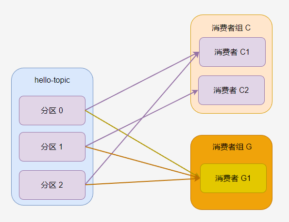
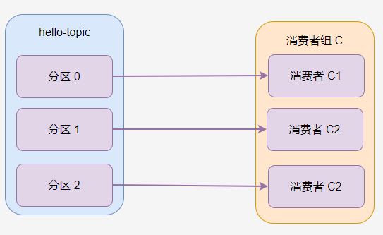
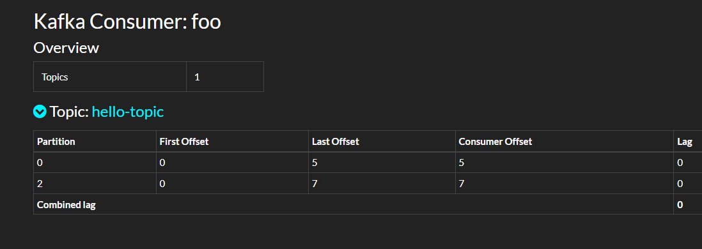

# 5.消费者

在第四章中的生产者中，介绍了比较多的生产者特性，而消费者很多特性跟生产者是一样的，因此本章简单介绍消费者程序的编写方式和一些问题的解决方法，不再过多介绍消费者的参数。


### 消费者和消费者组

创建一个消费者时，可以指定这个消费者所属的组(`GroupId`)，如果不指定，Kafka 默认会给其分配一个。


给消费者指定一个消费者组 `C` 的方式如下：

```csharp
        var config = new ConsumerConfig
        {
            BootstrapServers = "host1:9092,host2:9092",
            GroupId = "C",
            AutoOffsetReset = AutoOffsetReset.Earliest
        };
```


消费者组是一个很重要的配置。


如果一个主题只有一个分区，并且只有一个消费者组，只有一个消费者，那么消费过程如图。


> hello-topic 中的所有消息都会被 `C-C1` 消费。


**一个分区只能被消费者组中的一个消费者消费！**消费者组 C 中，无论有多少个消费者，分区 0 只有一个消费者可以消费。

如果 C1 消费者程序挂了，C2 消费者开始消费，那么默认是从 C1 消费者上次消费的位置开始消费。


如果一个主题有多个消费者组，那么每个消费者组都可以消费这个分区的所有消息。

每个消费者组都有自己的消费标记。


如果一个消费者组中有多个消费者，那么一个分区只会分配给其中一个消费者。


> 此时 C2 一直没有活干。


如果主题有多个分区，那么分区会被一定规则分配给消费者组的消费者，例如下图中，消费者 C1 被分配到 分区 0 和分区 2，消费者 C2 分到 分区 1。



> 消费者组 G 中只有一个消费者，因此 G1 被分配了所有分区。


一般来说，一个消费者组的消费者数量跟分区数量一致最好，这样每个消费者可以消费一个分区。过多的消费者会导致部分消费者不能消费消息，过少的消费者会导致单个消费者需要处理多个分区的消息。




在消费者连接到 Broker 之后，Broker 便会给消费者分配主题分区。

在默认情况下，消费者的群组成员身份标识是临时的。当一个消费者离开群组时，分配给它的分区所有权将被撤销；当该消费者重新加入时，将通过再均衡协议为其分配一个新的成员 ID 和新分区。可以给消费者分配一个唯一的 `group.instance.id`，让它成为群组的固定成员。

```csharp
        var config = new ConsumerConfig
        {
            BootstrapServers = "192.168.3.158:19092",
            GroupId = "C",
            GroupInstanceId = "C1",
            AutoOffsetReset = AutoOffsetReset.Earliest,
        };
```


如果两个消费者使用相同的 `group.instance.id` 加入同一个群组，则第二个消费者会收到错误，告诉它具有相同 ID 的消费者已存在。


### 消费位置


默认情况下，消费者的 `AutoOffsetReset` 参数是 `AutoOffsetReset.Earliest`，会自动从消费者组最近消费到的位置开始消费。

```csharp
    static void Main()
    {
        var config = new ConsumerConfig
        {
            BootstrapServers = "192.168.3.158:19092",
            GroupId = "foo",
            AutoOffsetReset = AutoOffsetReset.Earliest
        };

        using (var consumer = new ConsumerBuilder<int, string>(config).Build())
        {
            consumer.Subscribe("hello-topic");
            while (true)
            {
                var consumeResult = consumer.Consume();
                
                Console.WriteLine(consumeResult.Message.Value);
            }
        }
    }
```


AutoOffsetReset 的定义如下：

```csharp
    public enum AutoOffsetReset
    {
        Latest,
        Earliest,
        Error
    }
```

```csharp
        public AutoOffsetReset? AutoOffsetReset
        {
            get
            {
                return (AutoOffsetReset?)GetEnum(typeof(AutoOffsetReset), "auto.offset.reset");
            }
            set
            {
                SetObject("auto.offset.reset", value);
            }
        }
```


下面是三个枚举的使用说明：

- `latest` (default) which means consumers will read messages from the tail of the partition

  最新(默认) ，这意味着使用者将从分区的尾部读取消息，只消费最新的信息，即自从消费者上线后才开始推送来的消息。那么会导致忽略掉之前没有处理的消息。

- `earliest` which means reading from the oldest offset in the partition

  这意味着从分区中最早的偏移量读取；自动从消费者上次开始消费的位置开始，进行消费。

- `none` throw exception to the consumer if no previous offset is found for the consumer's group

  如果没有为使用者的组找到以前的偏移量，则不会向使用者抛出异常。
  
  
  
  可以在 Kafdrop 中看到消费的偏移量。




### 手动提交

客户端可以设置手动活自动确认消息。

```csharp
        var config = new ConsumerConfig
        {
            BootstrapServers = "192.168.3.158:19092,192.168.3.158:29092,192.168.3.158:39092",
            GroupId = "foo",
            // 是否自动提交，对自行定位消费位置无影响
            EnableAutoCommit = false
        };
```


```csharp
                var consumeResult = consumer.Consume();
                consumer.Commit();
```


### 消费定位

消费者可以自行设置要消费哪个分区的消息以及设置偏移量。

示例程序如下：

```csharp
    static void Main()
    {
        var config = new ConsumerConfig
        {
            BootstrapServers = "192.168.3.158:19092,192.168.3.158:29092,192.168.3.158:39092",
            GroupId = "foo",
            // 是否自动提交，对自行定位消费位置无影响
            EnableAutoCommit = true
        };

        using (var consumer = new ConsumerBuilder<Ignore, string>(config).Build())
        {
            // 重新设置此消费组在某个分区的偏移量
            consumer.Assign(new TopicPartitionOffset(new TopicPartition("hello-topic", new Partition(0)), new Offset(0)));
            consumer.Assign(new TopicPartitionOffset(new TopicPartition("hello-topic", new Partition(1)), new Offset(0)));
            consumer.Assign(new TopicPartitionOffset(new TopicPartition("hello-topic", new Partition(2)), new Offset(0)));

            consumer.Subscribe("hello-topic");
            while (true)
            {
                var consumeResult = consumer.Consume();

                Console.WriteLine(consumeResult.Message.Value);
            }
        }
    }
```


如果要从指定时间开始消费，示例如下：

```csharp
    static void Main()
    {
        var config = new ConsumerConfig
        {
            BootstrapServers = "192.168.3.158:19092,192.168.3.158:29092,192.168.3.158:39092",
            GroupId = "foo",
            // 是否自动提交，对自行定位消费位置无影响
            EnableAutoCommit = true
        };

        using (var consumer = new ConsumerBuilder<Ignore, string>(config).Build())
        {
            var timestamp = new Timestamp(DateTime.Now.AddDays(-1));
            // 重新设置此消费组在某个分区的偏移量
            consumer.Assign(consumer.OffsetsForTimes(new List<TopicPartitionTimestamp>
            {
                new TopicPartitionTimestamp(new TopicPartition("hello-topic", new Partition(0)),timestamp),
                new TopicPartitionTimestamp(new TopicPartition("hello-topic", new Partition(1)),timestamp),
                new TopicPartitionTimestamp(new TopicPartition("hello-topic", new Partition(2)),timestamp)
            }, timeout: TimeSpan.FromSeconds(100)));

            consumer.Subscribe("hello-topic");
            while (true)
            {
                var consumeResult = consumer.Consume();

                Console.WriteLine(consumeResult.Message.Value);
            }
        }
    }
```


### 条件订阅

RabbitMQ 中有模糊订阅，但是 Kafka 中没有，所以如果想订阅符合条件的 Topic，需要先拿到集群中的所有 Topic，筛选后，订阅这些 Topic。

示例代码如下：

```csharp
    static async Task Main()
    {
        var adminConfig = new AdminClientConfig
        {
            BootstrapServers = "192.168.3.158:19092"
        };

        var config = new ConsumerConfig
        {
            BootstrapServers = "192.168.3.158:19092",
            GroupId = "C",
            GroupInstanceId = "C1",
            AutoOffsetReset = AutoOffsetReset.Earliest,
        };

        List<string> topics = new List<string>();

        using (var adminClient = new AdminClientBuilder(adminConfig).Build())
        {
            // 获取集群所有 topic
            var metadata = adminClient.GetMetadata(TimeSpan.FromSeconds(10));
            var topicsMetadata = metadata.Topics;
            var topicNames = metadata.Topics.Select(a => a.Topic).ToList();

            topics.AddRange(topicNames.Where(x => x.StartsWith("hello-")));
        }

        using (var consumer = new ConsumerBuilder<string, string>(config)
            .Build())
        {
            consumer.Subscribe(topics); 
            while (true)
            {
                var consumeResult = consumer.Consume();
                Console.WriteLine($"key:{consumeResult.Message.Key},value:{consumeResult.Message.Value},partition:{consumeResult.Partition}");
            }
        }
    }
```


消费者中的反序列化器、拦截器、处理器，可以参考第四章中的生产者，这里不在赘述。
