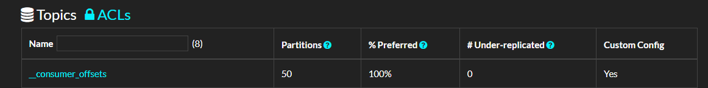

# 6.消费者


### 消费者和消费者组

创建一个消费者时，可以指定这个消费者所属的组，如果不指定，默认会给其分配一个。


```csharp
        var config = new ConsumerConfig
        {
            BootstrapServers = "host1:9092,host2:9092",
            GroupId = "C",
            AutoOffsetReset = AutoOffsetReset.Earliest
        };
```


如果一个主题，只有一个分区，那么一个消费者组有一个消费者，会是这样。


在消费者连接到 Broker 之后，Broker 便会给消费者分配主题分区。

在默认情况下，消费者的群组成员身份标识是临时的。当一个消费者离开群组时，分配给它的分区所有权将被撤销；当该消费者重新加入时，将通过再均衡协议为其分配一个新的成员ID和新分区。可以给消费者分配一个唯一的group.instance.id，让它成为群组的固定成员。

```csharp
        var config = new ConsumerConfig
        {
            BootstrapServers = "192.168.3.158:19092",
            GroupId = "C",
            GroupInstanceId = "C1",
            AutoOffsetReset = AutoOffsetReset.Earliest,
        };
```

如果两个消费者使用相同的group.instance.id加入同一个群组，则第二个消费者会收到错误，告诉它具有相同ID的消费者已存在。


### ACK 提交方式

本节主要是消费定位问题。

```csharp
    static void Main()
    {
        var config = new ConsumerConfig
        {
            BootstrapServers = "192.168.3.158:19092",
            GroupId = "foo",
            AutoOffsetReset = AutoOffsetReset.Earliest
        };

        using (var consumer = new ConsumerBuilder<int, string>(config).Build())
        {
            consumer.Subscribe("hello-topic");
            while (true)
            {
                var consumeResult = consumer.Consume();
                
                Console.WriteLine(consumeResult.Message.Value);
            }
        }
    }
```


```
    public enum AutoOffsetReset
    {
        Latest,
        Earliest,
        Error
    }
```

```csharp
        public AutoOffsetReset? AutoOffsetReset
        {
            get
            {
                return (AutoOffsetReset?)GetEnum(typeof(AutoOffsetReset), "auto.offset.reset");
            }
            set
            {
                SetObject("auto.offset.reset", value);
            }
        }
```


- `latest` (default) which means consumers will read messages from the tail of the partition

  最新(默认) ，这意味着使用者将从分区的尾部读取消息，只消费最新的信息，即自从消费者上线后才开始推送来的消息。那么会导致忽略掉之前没有处理的消息。

- `earliest` which means reading from the oldest offset in the partition

  这意味着从分区中最早的偏移量读取；自动从消费者上次开始消费的位置开始，进行消费。

- `none` throw exception to the consumer if no previous offset is found for the consumer's group

  如果没有为使用者的组找到以前的偏移量，则不会向使用者抛出异常


手动提交

```
                var consumeResult = consumer.Consume();
                consumer.Commit();
```


### 消费定位

```csharp
    static void Main()
    {
        var config = new ConsumerConfig
        {
            BootstrapServers = "192.168.3.158:19092,192.168.3.158:29092,192.168.3.158:39092",
            GroupId = "foo",
            // 是否自动提交，对自行定位消费位置无影响
            EnableAutoCommit = true
        };

        using (var consumer = new ConsumerBuilder<Ignore, string>(config).Build())
        {
            // 重新设置此消费组在某个分区的偏移量
            consumer.Assign(new TopicPartitionOffset(new TopicPartition("hello-topic", new Partition(0)), new Offset(0)));
            consumer.Assign(new TopicPartitionOffset(new TopicPartition("hello-topic", new Partition(1)), new Offset(0)));
            consumer.Assign(new TopicPartitionOffset(new TopicPartition("hello-topic", new Partition(2)), new Offset(0)));

            consumer.Subscribe("hello-topic");
            while (true)
            {
                var consumeResult = consumer.Consume();

                Console.WriteLine(consumeResult.Message.Value);
            }
        }
    }
```


如果要从指定时间开始消费

```csharp
    static void Main()
    {
        var config = new ConsumerConfig
        {
            BootstrapServers = "192.168.3.158:19092,192.168.3.158:29092,192.168.3.158:39092",
            GroupId = "foo",
            // 是否自动提交，对自行定位消费位置无影响
            EnableAutoCommit = true
        };

        using (var consumer = new ConsumerBuilder<Ignore, string>(config).Build())
        {
            var timestamp = new Timestamp(DateTime.Now.AddDays(-1));
            // 重新设置此消费组在某个分区的偏移量
            consumer.Assign(consumer.OffsetsForTimes(new List<TopicPartitionTimestamp>
            {
                new TopicPartitionTimestamp(new TopicPartition("hello-topic", new Partition(0)),timestamp),
                new TopicPartitionTimestamp(new TopicPartition("hello-topic", new Partition(1)),timestamp),
                new TopicPartitionTimestamp(new TopicPartition("hello-topic", new Partition(2)),timestamp)
            }, timeout: TimeSpan.FromSeconds(100)));

            consumer.Subscribe("hello-topic");
            while (true)
            {
                var consumeResult = consumer.Consume();

                Console.WriteLine(consumeResult.Message.Value);
            }
        }
    }
```


消费者中的反序列化器、拦截器、处理器，可以参考第四章中的生产者，这里不在赘述。




